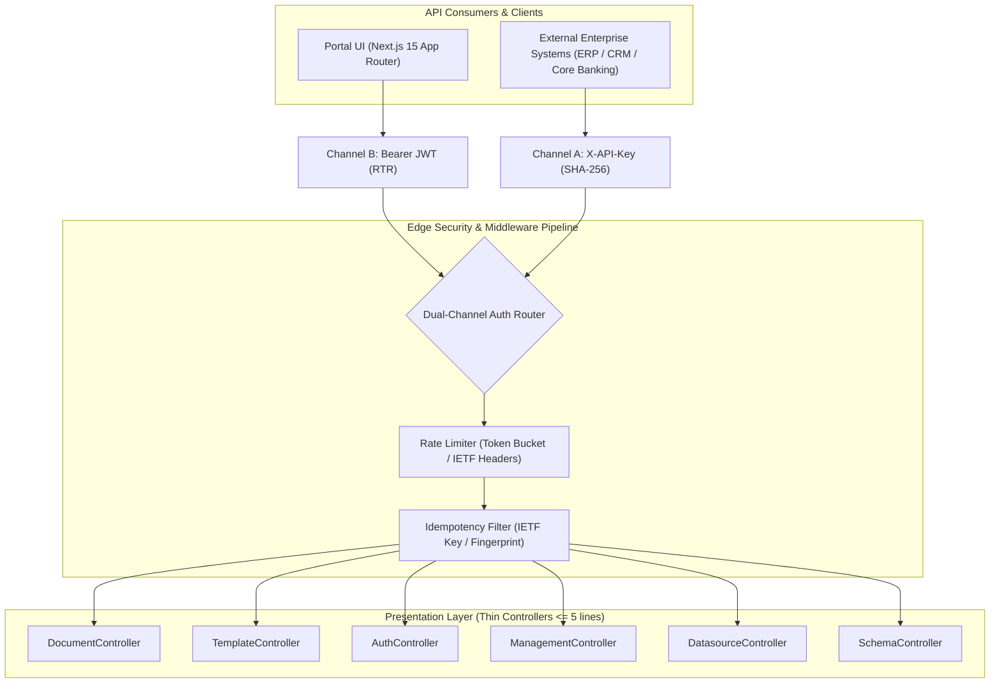

<ai_directive>
CRITICAL ATTENTION ROUTING: 
This file (`API_CONTRACT.md`) is the AUTHORITATIVE SINGLE SOURCE OF TRUTH (SSoT) for all REST API endpoints, Request/Response DTO wire schemas, Authentication channels, and Edge middleware protocols across the SMK Document Server.
- NEVER invent new response envelopes. Always use the envelopes defined in Section 3.
- ALWAYS emit RFC 9457 Problem Details (`application/problem+json`) for all error responses.
- State-mutating endpoints (`POST`) MUST support the IETF `Idempotency-Key` protocol specified in Section 2.3.
- Every endpoint MUST adhere strictly to the global design principles, typed contracts, and tenant-scoped authorization boundaries.
</ai_directive>

<api_contract_scope>

# 📡 API Contract & Authentication Specification

> **Target Standard:** RESTful HTTP Gateway, RFC 9457 (Problem Details), IETF `Idempotency-Key` (draft-ietf-httpapi-idempotency-key), IETF `RateLimit-*` Headers, OpenAPI 3.1, OWASP API Security Top 10 (2023).

---

## 1. 🔐 Dual-Channel Authentication & Security Architecture

The SMK Document Server operates as a high-throughput enterprise document gateway enforcing strict **Dual-Channel Authentication** based on the caller context and operational intent.



### 1.1 Authentication Channel Matrix

| Channel | Authentication Type | Required Header | Intended Audience | Security Characteristics | Target Controllers |
|---|---|---|---|---|---|
| **Channel A** | **API Key (M2M)** | `X-API-Key: <key>` | External Backend Systems (ERP/CRM) | Secret stored as SHA-256 hash in DB; mapped to specific `ProjectId`; stateless; no session overhead. | `DocumentController`, `TemplateController`, `DatasourceController` |
| **Channel B** | **Bearer JWT** | `Authorization: Bearer <jwt>` | Web Portal Users (Next.js 15) | Signed via HMAC-SHA256 (`Jwt:Secret`); contains `sub` (UserId), `email`, `SystemRole`, and `ProjectId`; issued with Refresh Token Rotation (RTR). | `ManagementController`, `AuthController`, `TemplateController` (editor mode) |
| **Channel A Gated** | **M2M Gated Portal Auth** | `X-API-Key: <key>` | Portal Identity Gateway | Portal authentication endpoints gated by project API Key to prevent public brute-force attacks. | `POST /api/v1/auth/login`, `POST /api/v1/auth/refresh` |
| **Public** | **Anonymous** | *None* | Health Check & Monitoring | Unauthenticated endpoints for container liveness and telemetry. | `GET /health`, `GET /swagger` |

### 1.2 Channel Specifications

*   **Channel A (Machine-to-Machine API Keys):**
    *   Header: `X-API-Key: smk_live_xxxxxxxxxxxxxxxxxxxxxxxx`
    *   Verification: The raw key is hashed using SHA-256 and compared in constant-time against `ApiKeys.KeyHash` in PostgreSQL.
    *   Context Resolution: Automatically hydrates `IExecutionContext.ProjectId` and `IExecutionContext.CallerApp`, ensuring zero cross-tenant access (OWASP BOLA/IDOR protection).
*   **Channel B (Portal Identity & Refresh Token Rotation):**
    *   Access Token: Short-lived JWT (15 minutes).
    *   Refresh Token: Single-use opaque string (7 days TTL). Each `/refresh` call invalidates the old token and issues a new pair. Reuse of an invalidated token triggers an immediate tenant-wide session revocation.
*   **Standard Edge Security Headers:**
    *   `X-Content-Type-Options: nosniff`
    *   `X-Frame-Options: DENY`
    *   `Strict-Transport-Security: max-age=31536000; includeSubDomains`
    *   `Content-Security-Policy: default-src 'none'; frame-ancestors 'none';`

---

## 2. 🌍 Global API Design Principles & Wire Protocols

All public endpoints across `backend-v2/` MUST conform to the following international REST and HTTP standards:

### 2.1 Canonical Resource Routing & HTTP Verbs

*   **Prefix Standard:** All business routes MUST use `api/v1/{resource}`.
*   **Plural Nouns:** Resources are plural lowercase nouns (e.g., `/api/v1/templates`, `/api/v1/documents`).
*   **Verb Semantics & Status Codes:**
    *   `GET`: Safe and idempotent read. Returns `200 OK` with payload.
    *   `POST`: Resource creation or action dispatch. Returns `201 Created` with `Location` header pointing to the created resource URI, or `200 OK` for calculations/stateless transformations.
    *   `PUT`: Full replacement or idempotent update. Returns `200 OK` with updated resource.
    *   `PATCH`: Partial update. Returns `200 OK` with updated resource.
    *   `DELETE`: Resource deletion. Returns `204 NoContent` (Zero response body).
    *   `400 Bad Request`: Client syntax error or FluentValidation failure (RFC 9457).
    *   `401 Unauthorized`: Missing or invalid credentials.
    *   `403 Forbidden`: Authenticated identity lacks permission or violates tenant boundary.
    *   `404 Not Found`: Target resource does not exist in the tenant scope.
    *   `409 Conflict`: Business invariant collision (e.g., duplicate slug) or in-flight idempotency lease.
    *   `422 Unprocessable Entity`: Request payload violates semantic rules or idempotency fingerprint mismatch.
    *   `429 Too Many Requests`: Rate limit quota exhausted.
    *   `500 Internal Server Error`: Unhandled infrastructure failure (ProblemDetails without stack trace leaks).

---

### 2.2 🛡️ IETF Idempotency-Key Protocol Specification

State-mutating HTTP endpoints (`POST`, `PUT`, `DELETE`) implement the **IETF Draft Specification** (`draft-ietf-httpapi-idempotency-key`) via `[Idempotent]` (`IdempotencyFilter.cs`). This guarantees that client network retries execute business operations exactly once, returning identical cached responses with zero duplicate database writes or storage uploads.

#### 1. Header Specification
*   **Request Header:** `Idempotency-Key: <opaque-string-max-128-chars>` (UUIDv7 or UUIDv4 strongly recommended).
*   **Response Header (Transparency):** `Idempotency-Replayed: true` (attached exclusively when the response is served from the idempotency cache).
*   **Preserved Headers:** Response headers critical to resource location (e.g., `Location`) are cached and replayed alongside the payload.

#### 2. Cryptographic Request Fingerprinting (SHA-256)
To prevent key tampering or accidental key collisions between different operations, `RequestFingerprintCalculator` computes a deterministic SHA-256 signature:
$$\text{Fingerprint} = \text{SHA256}(\text{Method} + \text{NormalizedPath} + \text{SerializedPayloadJson})$$

#### 3. The 6-State Lifecycle & Status Code Matrix

| Scenario | Incoming Request State | Idempotency Store State | Server Action | HTTP Status Code | Response Payload & Headers |
|---|---|---|---|---|---|
| **1. Fresh Execution (Cache Miss)** | Valid key + payload | Key not found | Acquire atomic in-flight lock (2 min TTL), execute UseCase, commit DB/MinIO, cache completed response (24h TTL). | `200 OK` / `201 Created` | Fresh response body. `Idempotency-Replayed` header is **absent**. |
| **2. Idempotent Replay (Cache Hit)** | Identical key + matching fingerprint | Status: `Completed` | Skip UseCase and DB entirely. Immediately stream cached response JSON. | Original Status (`200` / `201`) | Cached response body + `Idempotency-Replayed: true` + cached `Location` header. |
| **3. Concurrent Race (In-Flight)** | Identical key while 1st request still processing | Status: `InFlight` | Reject overlapping concurrent request to prevent race conditions. | `409 Conflict` | RFC 9457 ProblemDetails (`errorCode: IDEMPOTENCY_IN_FLIGHT`). |
| **4. Payload Mismatch (Tampering)** | Identical key + DIFFERENT fingerprint | Key exists | Detect key reuse with altered payload. Reject execution immediately. | `422 Unprocessable Entity` | RFC 9457 ProblemDetails (`errorCode: IDEMPOTENCY_PAYLOAD_MISMATCH`). |
| **5. Failure Rollback (Auto-Eviction)** | Downstream throws exception or returns $\ge 400$ | Status: `InFlight` | Catch failure, immediately evict in-flight lock (`RemoveAsync`), rethrow exception to GlobalExceptionHandler. | Error Status (`400` / `500`) | Standard RFC 9457 response. Key is unlocked, allowing immediate client retry. |
| **6. Missing Mandatory Key** | Header absent or empty on endpoint with `Mandatory = true` | N/A | Intercept before execution; reject missing required header. | `400 Bad Request` | RFC 9457 ProblemDetails (`errorCode: MISSING_IDEMPOTENCY_KEY`). |

#### 4. Cache Scoping & TTL Rules
*   **Tenant Isolation:** Cache keys are scoped to the caller identity: `$"idempotency:{callerId}:{idempotencyKey}"` (where `callerId` is `CallerApp` or `ProjectId`).
*   **Completed Response TTL:** Default **24 Hours** (`TtlHours = 24`).
*   **In-Flight Lock TTL:** Default **2 Minutes** (prevents permanent deadlocks in case of unexpected process termination).

---

### 2.3 IETF RateLimit Headers Specification

High-throughput M2M endpoints are protected by token-bucket rate limiters. Responses emit both modern IETF Draft and legacy headers:

```http
RateLimit-Limit: 100
RateLimit-Remaining: 84
RateLimit-Reset: 12
RateLimit-Policy: 100;w=60
X-RateLimit-Limit: 100
X-RateLimit-Remaining: 84
X-RateLimit-Reset: 1730000012
```

When quota is exhausted, the server returns `429 Too Many Requests` with a `Retry-After: <seconds>` header and RFC 9457 body (`errorCode: RATE_LIMIT_EXCEEDED`).

---

### 2.4 Pagination Standards

To guarantee predictable latency and prevent memory exhaustion across list queries:
*   **Query Parameters:** `?page=1&limit=20` (Default `limit=20`, Hard cap `maxLimit=100`).
*   **Wire Envelope:** Wrapped in `PagedApiResponse<T>` with flattened pagination attributes for $O(1)$ client destructuring:
    ```json
    {
      "data": [ ... ],
      "total": 42,
      "page": 1,
      "limit": 20
    }
    ```
*   **Single Source of Truth:** Backed strictly by `SmkDoc.Api.Common.Responses.PagedApiResponse<T>`:
    ```csharp
    public record PagedApiResponse<T>(
        IEnumerable<T> Data,
        int Total,
        int Page,
        int Limit
    ) : ApiResponse<IEnumerable<T>>(Data);
    ```

---

<envelopes>

## 3. 📦 Standard API Response Envelopes & RFC 9457 Problem Details

Every JSON API response emitted by the SMK Document Server MUST conform strictly to one of the canonical envelopes below. **Anonymous objects (`new { }`) and legacy boolean success flags (`"success": true`) are STRICTLY FORBIDDEN.** The HTTP Status Code and standard HTTP headers (`Date`, `traceparent`) serve as the authoritative transport contract.

### 3.1 Single Resource Envelope (`ApiResponse<T>`)
Used for single entity reads, mutations, and status confirmations.
```json
{
  "data": {
    "id": "01926b42-7c3a-7000-8000-123456789abc",
    "projectId": "01926b40-1111-7000-8000-000000000001",
    "name": "Commercial Tax Invoice",
    "slug": "tax-invoice-th",
    "category": "Finance",
    "createdAt": "2026-10-10T12:00:00.000Z"
  }
}
```

### 3.2 Paged Collection Envelope (`PagedApiResponse<T>`)
Used for standard paginated queries. Flattens pagination fields directly on the root envelope for seamless client unboxing:
```json
{
  "data": [
    {
      "id": "01926b42-7c3a-7000-8000-123456789abc",
      "name": "Commercial Tax Invoice",
      "slug": "tax-invoice-th"
    }
  ],
  "total": 42,
  "page": 1,
  "limit": 20
}
```

### 3.3 Raw Binary Media Streams (Zero Envelope)
Endpoints returning rendered documents (`application/pdf`, `application/vnd.openxmlformats-...`) bypass JSON wrappers entirely, streaming raw bytes directly to the HTTP response:
*   **Live Preview (In-Memory):** `Content-Disposition: inline`
*   **File Download:** `Content-Disposition: attachment; filename="document-01926b42.pdf"`

---

### 3.4 RFC 9457 Problem Details Schema & Semantic Error Standards

All error responses emitted by `GlobalExceptionHandler` (`IExceptionHandler`) MUST return `Content-Type: application/problem+json` formatted according to **RFC 9457 (Problem Details for HTTP APIs)**. Generic, ambiguous, or un-actionable error messages are strictly prohibited across the SMK Document Server.

#### 1. The 4 Golden Laws of Error Semantics

To ensure error payloads can be consumed seamlessly by both machines (M2M automation) and humans (portal users and developers), all errors must obey:

1. **Law 1: Domain-Centric `errorCode` (Machine-Readable Token)**
   * MUST be formatted in `SCREAMING_SNAKE_CASE`.
   * MUST express the exact **Domain Cause** rather than generic HTTP statuses.
   * ❌ **Prohibited:** `BAD_REQUEST`, `VALIDATION_ERROR`, `ERROR_400`, `INVALID_DATA` (Meaningless noise).
   * ✅ **Required:** `SLUG_ALREADY_EXISTS`, `TEMPLATE_PAYLOAD_SCHEMA_MISMATCH`, `IDEMPOTENCY_IN_FLIGHT`, `STORAGE_SERVICE_UNAVAILABLE`.
   * *Rationale:* Enables programmatic handling (client-side switch statements, i18n translation lookup, and telemetry aggregation).

2. **Law 2: Context-Rich `detail` (Instance-Specific Narrative)**
   * MUST contain the specific, human-readable context of the current occurrence.
   * NEVER blindly echo the generic HTTP status `title`.
   * ❌ **Prohibited:** `"Conflict"`, `"Validation failed"`, `"Operation could not be completed"`.
   * ✅ **Required:** `"Template with slug 'tax-invoice-th' already exists in Project '01926b40-1111-7000-8000-000000000001'."`.

3. **Law 3: Actionable Field Validation (`invalidParams`)**
   * Validation errors MUST specify the exact field name matching the JSON payload (`camelCase` with dot-notation for nested objects, e.g., `"customer.taxId"`).
   * The `reason` MUST articulate **"Expected vs Actual"** so the client knows precisely how to fix it.
   * ❌ **Prohibited:** `"slug is invalid"`, `"taxId length error"`.
   * ✅ **Required:** `"Slug 'Tax_Invoice#1' contains invalid characters. Must be lowercase alphanumeric with hyphens only (pattern: ^[a-z0-9-]+$)."`.
   * ✅ **Required:** `"Tax ID must be exactly 13 numeric digits (received 10 digits)."`.

4. **Law 4: Zero Information Leakage (Zero-Trust Security)**
   * On unhandled server failures (`500 Internal Server Error`), the server MUST emit a generic, sanitized `detail` (`"An unexpected internal error occurred."`) to external consumers.
   * Internal exception type names, stack traces, database connection strings, and raw SQL queries MUST NEVER leak over HTTP. Full telemetry MUST be sent exclusively to internal structured logs (`logger.LogError`).

---

#### 2. Canonical RFC 9457 Wire Schema

```json
{
  "type": "https://api.sammakorn.co.th/errors/slug-already-exists",
  "title": "Conflict",
  "status": 409,
  "detail": "Template with slug 'tax-invoice-th' already exists in Project '01926b40-1111-7000-8000-000000000001'.",
  "instance": "/api/v1/templates",
  "errorCode": "SLUG_ALREADY_EXISTS",
  "traceId": "00-4bf92f3577b34da6a3ce929d0e0e4736-00f067aa0ba902b7-01",
  "invalidParams": [
    {
      "name": "slug",
      "reason": "Slug 'tax-invoice-th' is already registered within Project '01926b40-1111-7000-8000-000000000001'."
    }
  ]
}
```

---

#### 3. Global Error Code Taxonomy

| HTTP Status | Error Code (`errorCode`) | Canonical Rationale & Semantic Description |
|---|---|---|
| **400 Bad Request** | `VALIDATION_FAILED` | Input payload failed static FluentValidation rules; broken fields enumerated in `invalidParams`. |
| **400 Bad Request** | `MISSING_IDEMPOTENCY_KEY` | Mutation endpoint requires `Idempotency-Key` header (`Mandatory = true`). |
| **401 Unauthorized** | `INVALID_CREDENTIALS` | Incorrect email/password or revoked/non-existent API key. |
| **401 Unauthorized** | `TOKEN_EXPIRED` | Bearer JWT access token expired; client must refresh via `/api/v1/auth/refresh`. |
| **403 Forbidden** | `FORBIDDEN_TENANT_ACCESS` | Authenticated client attempted to access or mutate an entity outside its `ProjectId` boundary. |
| **403 Forbidden** | `INSUFFICIENT_ROLE` | Caller lacks the requisite `SystemRole` (e.g., Member attempting Admin action). |
| **404 Not Found** | `RESOURCE_NOT_FOUND` | Target entity does not exist within the caller's tenant boundary. |
| **409 Conflict** | `SLUG_ALREADY_EXISTS` | Unique constraint violation on entity slug within the project. |
| **409 Conflict** | `IDEMPOTENCY_IN_FLIGHT` | An in-flight request with the identical `Idempotency-Key` is currently executing. |
| **410 Gone** | `DRAFT_EXPIRED` | In-memory template draft has expired beyond its 2-hour TTL and was evicted. |
| **422 Unprocessable** | `IDEMPOTENCY_PAYLOAD_MISMATCH` | `Idempotency-Key` was previously completed with a different request payload fingerprint. |
| **422 Unprocessable** | `SCHEMA_VALIDATION_FAILED` | Runtime JSON payload failed validation against template's compiled Draft-07 schema. |
| **429 Too Many Req** | `RATE_LIMIT_EXCEEDED` | Request rate exceeded tier quota; client must back off until `Retry-After` seconds. |
| **500 Internal Error** | `RENDER_FAILED` | Gotenberg Chromium or LibreOffice crashed, timed out, or threw an unhandled engine error. |
| **502 Bad Gateway** | `STORAGE_SERVICE_UNAVAILABLE` | MinIO S3 object storage is unreachable or refused connection during artifact upload. |

</envelopes>

---

## 4. 📡 Comprehensive Endpoint Catalog

All public endpoints are categorized below with explicit request/response DTO contracts.

### 4.1 Authentication & Identity Gateway (`/api/v1/auth`)

#### `POST /api/v1/auth/login`
Authenticates a portal user and issues access/refresh tokens.
*   **Auth Channel:** Channel A Gated (`X-API-Key: <key>`)
*   **Idempotency:** N/A (Standard Login)
*   **Request Body (`application/json`):**
    ```json
    {
      "email": "architect@sammakorn.co.th",
      "password": "StrongPassword123!"
    }
    ```
*   **Response (200 OK):**
    ```json
    {
      "data": {
        "accessToken": "eyJhbGciOiJIUzI1NiIsIn...",
        "refreshToken": "7c3a70008000123456789abc...",
        "expiresInSeconds": 900,
        "tokenType": "Bearer",
        "user": {
          "id": "01926b42-1111-7000-8000-123456789abc",
          "email": "architect@sammakorn.co.th",
          "fullName": "Senior Architect",
          "systemRole": "SuperAdmin",
          "projectId": "01926b40-1111-7000-8000-000000000001"
        }
      }
    }
    ```

#### `POST /api/v1/auth/refresh`
Performs Refresh Token Rotation (RTR). Invalidate old refresh token, issue fresh pair.
*   **Auth Channel:** Channel A Gated (`X-API-Key: <key>`)
*   **Request Body (`application/json`):**
    ```json
    {
      "refreshToken": "7c3a70008000123456789abc..."
    }
    ```
*   **Response (200 OK):** `ApiResponse<AuthTokenResultDto>` (Same shape as login).

#### `GET /api/v1/auth/me`
Retrieves claims and profile information of currently authenticated user.
*   **Auth Channel:** Channel B (`Authorization: Bearer <jwt>`)
*   **Response (200 OK):** `ApiResponse<UserProfileDto>`.

---

### 4.2 Document Operations & Rendering Gateway (`/api/v1/documents`)

#### `POST /api/v1/documents/generate/{slug}`
High-throughput document generation pipeline. Merges JSON payload into template and renders binary output (PDF/DOCX/XLSX).
*   **Auth Channel:** Channel A (`X-API-Key`) or Channel B (`Bearer JWT`)
*   **Idempotency:** 🛡️ **Supported** (`[Idempotent(Mandatory = false)]`, 24h TTL)
*   **Route Parameter:** `slug` (string, e.g., `commercial-invoice`)
*   **Request Body (`application/json`):**
    ```json
    {
      "payload": {
        "invoiceNo": "INV-2026-001",
        "issueDate": "2026-10-10",
        "customer": {
          "name": "Acme Corp",
          "taxId": "0105558000000"
        },
        "items": [
          { "description": "Cloud Gateway License", "qty": 1, "unitPrice": 50000 }
        ],
        "totalAmount": 50000
      },
      "outputFormat": "Pdf",
      "options": {
        "saveToStorage": true,
        "printBackground": true
      }
    }
    ```
*   **Response (200 OK):** Direct Binary Stream (`application/pdf`)
    *   Header: `Content-Disposition: attachment; filename="commercial-invoice-INV-2026-001.pdf"`
    *   Header: `Idempotency-Replayed: true` (if served from cache)

#### `POST /api/v1/documents/preview/{slug}`
100% Stateless in-memory rendering preview for Portal UI live editors. **Zero database mutations, zero MinIO uploads.**
*   **Auth Channel:** Channel A (`X-API-Key`) or Channel B (`Bearer JWT`)
*   **Idempotency:** Bypassed (Real-time keystroke rendering)
*   **Request Body:** Same shape as `/generate/{slug}`.
*   **Response (200 OK):** Direct Binary Stream with `Content-Disposition: inline`.

#### `POST /api/v1/documents/validate/{slug}`
Pre-flight JSON payload validation against the template's compiled JSON Schema Draft-07.
*   **Auth Channel:** Channel A (`X-API-Key`)
*   **Request Body (`application/json`):** `{ "payload": { ... } }`
*   **Response (200 OK):**
    ```json
    {
      "data": {
        "isValid": false,
        "errors": [
          { "path": "/customer/taxId", "message": "Expected string of length 13." }
        ]
      }
    }
    ```

#### `POST /api/v1/documents/html-to-pdf`
Raw ad-hoc HTML-to-PDF compilation via Chromium Gotenberg.
*   **Auth Channel:** Channel A (`X-API-Key`)
*   **Request Body (`application/json`):**
    ```json
    {
      "html": "<html><body><h1>Hello World</h1></body></html>",
      "options": {
        "landscape": false,
        "paperWidth": 8.27,
        "paperHeight": 11.69
      }
    }
    ```
*   **Response (200 OK):** Direct Binary Stream (`application/pdf`).

---

### 4.3 Template Lifecycle Operations (`/api/v1/templates`)

#### `GET /api/v1/templates`
Lists all templates available in the caller's scoped project.
*   **Auth Channel:** Channel A (`X-API-Key`) or Channel B (`Bearer JWT`)
*   **Query Parameters:** `?category=Finance&page=1&limit=20`
*   **Response (200 OK):** `PagedApiResponse<TemplateSummaryDto>`.

#### `GET /api/v1/templates/{templateId}`
Retrieves metadata and status of a single template.
*   **Auth Channel:** Channel A (`X-API-Key`) or Channel B (`Bearer JWT`)
*   **Route Parameter:** `templateId` (UUIDv7)
*   **Response (200 OK):** `ApiResponse<TemplateResultDto>`.

#### `POST /api/v1/templates`
Uploads and compiles a new document template.
*   **Auth Channel:** Channel A (`X-API-Key`) or Channel B (`Bearer JWT`)
*   **Idempotency:** 🛡️ **Supported** (`[Idempotent]`, 24h TTL)
*   **Request Content-Type:** `multipart/form-data`
*   **Form Fields:**
    *   `projectId` (uuid, required)
    *   `name` (string, 2..100 chars, required)
    *   `slug` (string, regex `^[a-z0-9-]+$`, required)
    *   `category` (string, optional)
    *   `engineType` (string: `"Gotenberg"` | `"OpenXmlWord"` | `"OpenXmlExcel"`, required)
    *   `file` (binary file: `.html`, `.docx`, `.xlsx`, max 10MB, required)
*   **Response (201 Created):**
    *   Header: `Location: /api/v1/templates/01926b42-7c3a-7000-8000-123456789abc`
    *   Body: `ApiResponse<TemplateResultDto>`

#### `GET /api/v1/templates/{templateId}/html`
Fetches raw HTML/Handlebars source code for Monaco Editor.
*   **Response (200 OK):** `ApiResponse<TemplateHtmlResultDto>`.

#### `PUT /api/v1/templates/{templateId}/html`
Saves updated HTML/Handlebars source code.
*   **Request Body (`application/json`):** `{ "htmlContent": "...", "changeNotes": "Updated footer layout" }`
*   **Response (200 OK):** `ApiResponse<TemplateResultDto>`.

#### `GET|PUT /api/v1/templates/{templateId}/mappings`
Manages field mapping definitions (Variable name ➔ Data source column).
*   **Response (200 OK):** `ApiResponse<FieldMappingDto>`.

#### `POST /api/v1/templates/draft/{draftId}/commit`
Publishes an in-memory editor draft to production.
*   **Idempotency:** 🛡️ **Supported** (`[Idempotent]`)
*   **Response (200 OK):** `ApiResponse<TemplateResultDto>`.

---

### 4.4 Management & Administration (`/api/v1/management`)

*(Restricted strictly to Portal Users with `SystemRole: SuperAdmin` or `Admin` via Channel B)*

#### `GET|POST /api/v1/management/projects`
Creates and lists tenant projects.
*   **POST Request Body:** `{ "name": "Accounting Dept", "description": "Finance templates" }`
*   **Response (201 Created):** `ApiResponse<ProjectDto>`.

#### `GET|POST|DELETE /api/v1/management/projects/{projectId}/api-keys`
Manages machine-to-machine API keys for external systems.
*   **POST Request Body:** `{ "name": "SAP-ERP-Production", "expiresAt": "2027-12-31T23:59:59Z" }`
*   **Response (201 Created):**
    ```json
    {
      "data": {
        "id": "01926b42-9999-7000-8000-123456789abc",
        "name": "SAP-ERP-Production",
        "rawApiKey": "smk_live_3f8a92b...",
        "warning": "Copy this key immediately. It is never displayed again."
      }
    }
    ```

#### `GET|POST|PUT|DELETE /api/v1/management/projects/{projectId}/users`
Administers user memberships and RBAC roles within a project.

#### `GET|POST /api/v1/management/settings/fonts`
Manages centralized TrueType/OpenType Thai fonts loaded into the Gotenberg Chromium runtime.

---

### 4.5 Datasources & Connection Integrations (`/api/v1/datasources`)

#### `GET|POST|PUT|DELETE /api/v1/datasources/connections`
Configures external enterprise SQL/REST connections (PostgreSQL, MS SQL, REST API endpoints).

#### `POST /api/v1/datasources/connections/test`
Validates connection strings and latency against external databases.
*   **Response (200 OK):**
    ```json
    {
      "data": {
        "isReachable": true,
        "latencyMs": 14,
        "serverVersion": "PostgreSQL 16.2"
      }
    }
    ```

#### `GET|POST|PUT|DELETE /api/v1/datasources/datasets`
Defines dynamic parameterized SQL queries or REST extraction scripts linked to templates.

---

### 4.6 Standalone Schema Validation (`/api/v1/schemas`)

#### `POST /api/v1/schemas/validate`
Stateless JSON Schema Draft-07 engine.
*   **Auth Channel:** Channel A (`X-API-Key`) or Anonymous
*   **Operational Invariant:** Pure stateless, zero DB queries, zero disk I/O.
*   **Request Body (`application/json`):**
    ```json
    {
      "schema": {
        "$schema": "http://json-schema.org/draft-07/schema#",
        "type": "object",
        "required": ["amount"],
        "properties": {
          "amount": { "type": "number", "minimum": 0 }
        }
      },
      "payload": {
        "amount": -50
      }
    }
    ```
*   **Response (200 OK):**
    ```json
    {
      "data": {
        "isValid": false,
        "errors": [
          "Value -50 is less than minimum 0."
        ]
      }
    }
    ```
*   **Status Code Note:** Always returns `200 OK` (wrapped in `ApiResponse<T>`) even when validation fails. The purpose of this endpoint is to diagnosticly answer "Is this valid?" without triggering global exception middleware.

---

### 4.7 Audit Logging & Telemetry Gateway (`/api/v1/logs`)

*(Protected by Channel B `Authorization: Bearer <jwt>`, consumes `SmkDoc.Api.Controllers.Rendering.AuditLogController`)*

#### `GET /api/v1/logs`
Lists paginated document generation audit logs with server-side filtering.
*   **Auth Channel:** Channel B (`Bearer JWT`)
*   **Query Parameters:** `?page=1&limit=50&app=crm`
*   **Response (200 OK):**
    ```json
    {
      "data": {
        "items": [
          {
            "id": "01926b42-7c3a-7000-8000-123456789abc",
            "templateSlug": "commercial-invoice",
            "callerApp": "crm",
            "renderEngine": "Gotenberg",
            "durationMs": 350,
            "status": "Success",
            "createdAt": "2026-10-10T12:00:00.000Z"
          }
        ],
        "totalCount": 128,
        "page": 1,
        "pageSize": 50
      }
    }
    ```

#### `GET /api/v1/logs/metrics`
Retrieves document generation aggregate performance metrics.
*   **Auth Channel:** Channel B (`Bearer JWT`)
*   **Query Parameters:** `?startDate=2026-10-01T00:00:00Z&endDate=2026-10-10T23:59:59Z`
*   **Response (200 OK):**
    ```json
    {
      "data": {
        "totalGenerations": 14200,
        "successfulGenerations": 14185,
        "failedGenerations": 15,
        "averageDurationMs": 284.5,
        "p95DurationMs": 620.0,
        "p99DurationMs": 950.0
      }
    }
    ```

---

</api_contract_scope>
