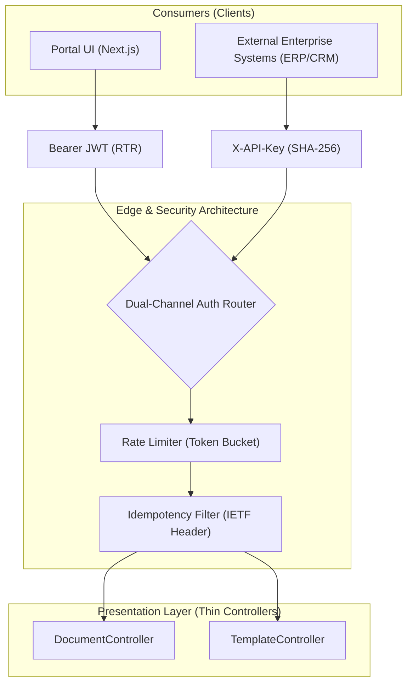

<ai_directive>
CRITICAL ATTENTION ROUTING: 
This file (`API_CONTRACT.md`) is the SINGLE SOURCE OF TRUTH for all REST API endpoints, Request/Response DTO schemas, and Authentication flows. 
- NEVER invent new response envelopes. Always use the envelopes defined in `<envelopes>`.
- ALWAYS return RFC 9457 Problem Details for errors.
- Adhere strictly to the Global API Design Principles.
</ai_directive>

<api_contract_scope>

# 📡 API Contract & Authentication Specification

## 1. 🔐 Authentication Channels (Dual-Channel)

The system enforces strict dual-channel authentication based on the caller context.



| Route Category | Primary Auth Channel | Header Required | Target Controllers |
|---|---|---|---|
| **M2M Document Generation** | Channel A (API Key) | `X-API-Key: <key>` | `DocumentController`, `TemplateController` |
| **Portal Administration** | Channel B (Bearer JWT) | `Authorization: Bearer <jwt>` | `UserManagementController`, `ApiKeyManagementController`, `DataConnectionsController` |
| **Portal Auth Gateway** | Channel A Gated (API Key) | `X-API-Key: <key>` | `POST /api/v1/auth/login`, `POST /api/v1/auth/refresh` |
| **Public Endpoints** | Anonymous | None | `GET /health`, `/swagger` |

* **Channel A (M2M External Services):** Uses `X-API-Key`. Mapped directly to a `ProjectId`. Stateless, no session or user identity required.
* **Channel B (Portal UI Users):** Uses `Authorization: Bearer <jwt>`. Stateless JWT signed via `Jwt:Secret`, containing `sub` (UserId), `email`, `SystemRole` (SuperAdmin/Member/Viewer), and optional `ProjectId`.

---

## 2. 🌍 Global API Design Principles

All new endpoints MUST adhere to the following world-class standards:

1. **Idempotency (Safe Mutations):** For critical operations (e.g., generating documents, charging credits), `POST` endpoints SHOULD support an **Optional (Opt-in)** `Idempotency-Key` header to safely handle network retries without duplicating actions. It is not required for read-only or low-impact endpoints.
2. **Strict HTTP Status Codes:** 
   - `200 OK`: Success (Reads, Updates)
   - `201 Created`: Resource created. MUST include `Location` header pointing to the new resource.
   - `204 No Content`: Successful Deletions (No body).
   - `400 Bad Request`: Validation failure (Returns RFC 9457).
   - `401 / 403`: Unauthorized (No Token) / Forbidden (Insufficient Role).
   - `409 Conflict`: Resource already exists / State conflict.
3. **Standardized Pagination:** Use Cursor-based pagination (`?cursor=xyz&limit=20`) for high-velocity endpoints (e.g., Audit Logs) to prevent data skipping. Use standard Offset pagination (`page`, `limit`) only for slow-moving administrative tables.
4. **RESTful Resource Naming:** Endpoints MUST be Plural Nouns (`/templates`, `/documents`). Avoid verbs in paths unless it's a specific action RPC pattern (`/templates/{id}/actions/generate`).
5. **Rate Limiting Visibility:** M2M endpoints MUST return Rate Limit headers (`X-RateLimit-Limit`, `X-RateLimit-Remaining`, `X-RateLimit-Reset`) to allow consumers to throttle themselves gracefully.

---

<envelopes>
## 3. 📦 Standard API Response Envelopes

Every successful JSON API response MUST adhere to one of the following authoritative schemas. **NEVER return anonymous objects (`new { }`).**

### 3.1 Single Resource Envelope (`ApiResponse<T>`)
Used for single entity reads and mutations.
```json
{
  "data": {
    "id": "3fa85f64-5717-4562-b3fc-2c963f66afa6",
    "name": "Invoice Template",
    "slug": "invoice"
  }
}
```

### 3.2 Paged Collection Envelope (`PagedApiResponse<T>`)
Used for offset list queries (e.g., `GET /api/v1/management/projects`).
```json
{
  "data": [
    { "id": "3fa85f64-...", "name": "Item 1" }
  ],
  "total": 42,
  "page": 1,
  "limit": 20
}
```

### 3.3 Cursor-based Pagination Envelope (`CursorApiResponse<T>`)
Used for high-velocity, infinite-scroll, or large dataset queries (e.g., Audit Logs).
```json
{
  "data": [
    { "id": "log_123...", "action": "Generate" }
  ],
  "nextCursor": "YWJjZGVmZw==",
  "hasNextPage": true
}
```

### 3.4 Binary & Media Streams (No Envelope)
Endpoints returning documents (`application/pdf`, `application/vnd.openxmlformats-officedocument...`) MUST return the direct binary stream.
- Preview: `Content-Disposition: inline`
- Download: `Content-Disposition: attachment; filename="..."`

### 3.5 Error Responses (RFC 9457 Problem Details)
All error responses emitted by `IExceptionHandler` MUST follow **RFC 9457** (which obsoletes RFC 7807):
```json
{
  "type": "https://api.sammakorn.co.th/errors/resource-conflict",
  "title": "Resource Conflict",
  "status": 409,
  "detail": "Slug 'invoice' is already in use.",
  "instance": "/api/v1/templates/invoice",
  "errorCode": "RESOURCE_CONFLICT"
}
```
</envelopes>

---

## 4. 🚀 Core API Endpoints

### 4.1 Authentication & Portal Identity (`/api/v1/auth`)
* **Login (Portal):** `POST /api/v1/auth/login` (Gated: `X-API-Key: <key>`)
* **Refresh Token:** `POST /api/v1/auth/refresh` (Gated: `X-API-Key: <key>`)
* **Get Current User:** `GET /api/v1/auth/me` (Auth: JWT)

### 4.2 Document Operations (`/api/v1/documents`)
* **Generate Document:** `POST /api/v1/documents/generate/{slug}` (Auth: API Key)
  * **Note:** Action pattern acceptable here due to complex RPC nature.
  * **Request Payload (Example):** 
    ```json
    {
      "payload": { "customerName": "John Doe", "amount": 1500 },
      "outputFormat": "Pdf"
    }
    ```
  * **Response:** Direct Binary Stream (`application/pdf`)
* **Pre-flight Payload Validation:** `POST /api/v1/documents/validate/{slug}` (Auth: API Key)
* **Live Preview:** `POST /api/v1/documents/preview/{slug}` (Auth: API Key)
* **Stateless Rendering (File to PDF):** `POST /api/v1/documents/render` (Auth: API Key)
* **Raw HTML to PDF:** `POST /api/v1/documents/html-to-pdf` (Auth: API Key)

### 4.3 Template Operations (`/api/v1/templates`)
* **List Templates:** `GET /api/v1/templates` (Auth: API Key) → `ApiResponse<IEnumerable<TemplateResultDto>>`
* **Get Template by ID:** `GET /api/v1/templates/{id}` (Auth: API Key)
* **Create Template:** `POST /api/v1/templates` (multipart/form-data) (201 Created)
* **Get/Save HTML for Editor:** `GET /api/v1/templates/{id}/html` & `PUT /api/v1/templates/{id}/html`
* **Field Mappings:** `GET/PUT /api/v1/templates/{id}/mappings`
* **Validate HTML:** `POST /api/v1/templates/{id}/validate`
* **Validate Payload:** `POST /api/v1/templates/{slug}/validate`

### 4.4 Management & Settings (`/api/v1/management`)
*(Requires Admin SystemRole + JWT Auth)*
* **Projects:** `GET|POST /api/v1/management/projects`
* **Project Users:** `GET|POST|PUT|DELETE /api/v1/management/projects/{projectId}/users`
* **API Keys:** `GET|POST|DELETE /api/v1/management/projects/{projectId}/api-keys`
* **System Settings:** `GET|POST /api/v1/management/settings/fonts`

### 4.5 Datasources & Connections (`/api/v1/datasources`)
*(Auth: JWT or API Key depending on context)*
* **Data Connections:** `GET|POST|PUT|DELETE /api/v1/datasources/connections`
* **Test Connection:** `POST /api/v1/datasources/connections/test`
* **Datasets:** `GET|POST|PUT|DELETE /api/v1/datasources/datasets`

### 4.6 Schema Validation (`/api/v1/schemas`)
* **Standalone Validation:** `POST /api/v1/schemas/validate`
  * **Request:** `{ "schema": { ... }, "payload": { ... } }`
  * **Response:** (HTTP 200 OK)
    ```json
    { "data": { "valid": false, "errors": ["'amount' is required."] } }
    ```
  * **Behavior:** Pure stateless, zero DB dependencies. Bounded in-memory compilation caching. Always returns `200 OK` (wrapped in `ApiResponse<T>`) even if validation fails, because the *purpose* of the endpoint is to answer "Is this valid?" without triggering global `400 Bad Request` middleware.

</api_contract_scope>
