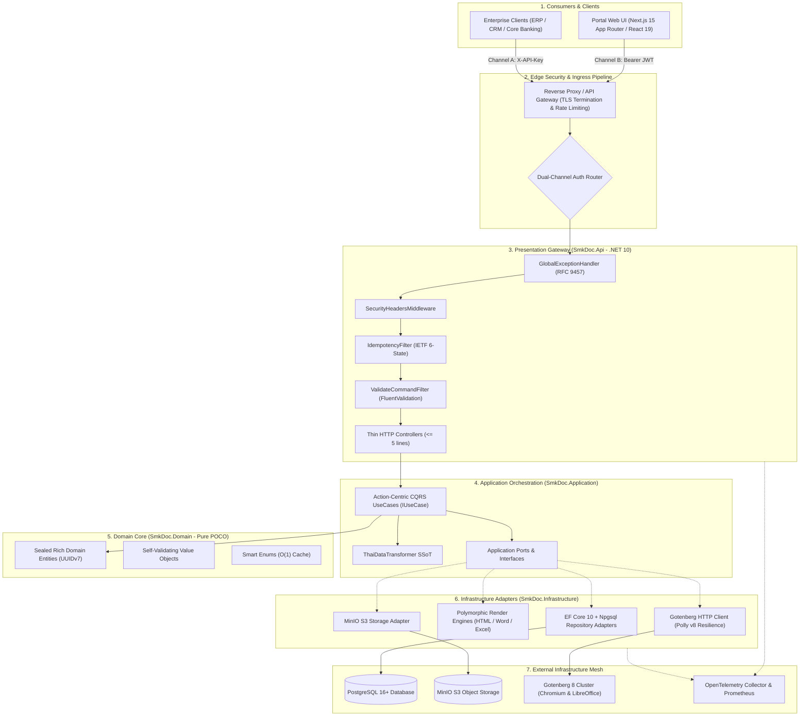
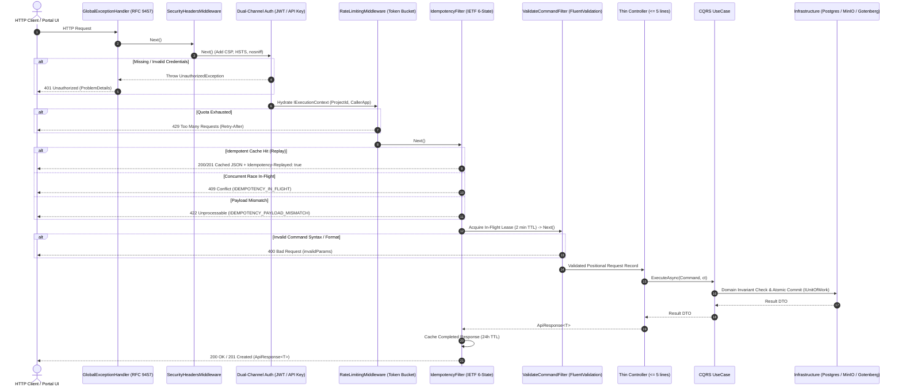
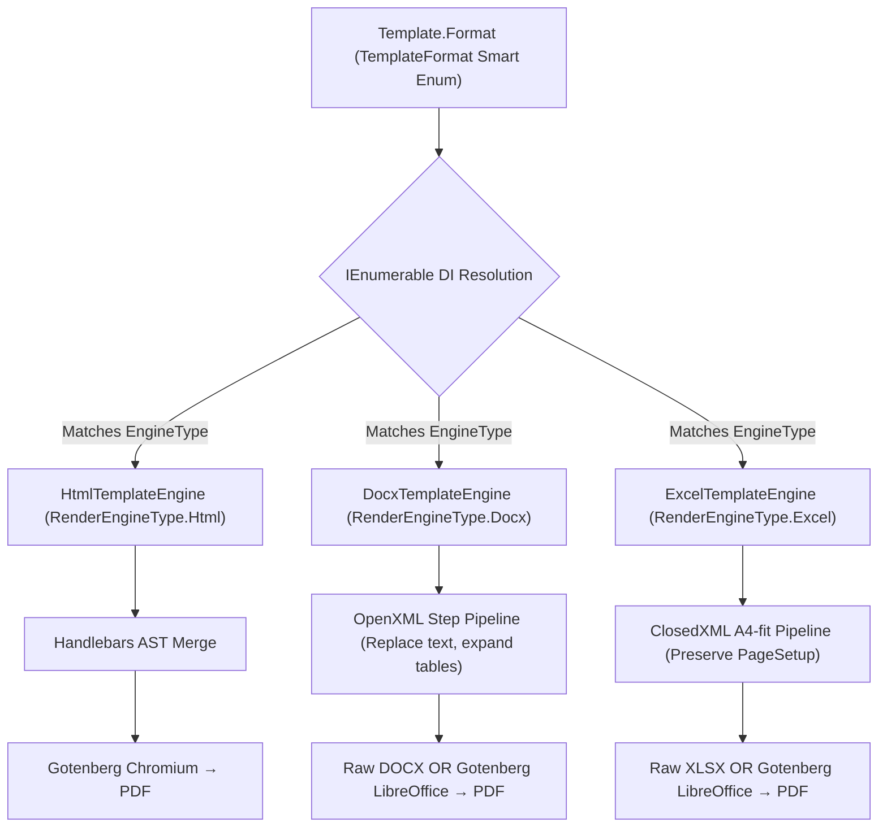
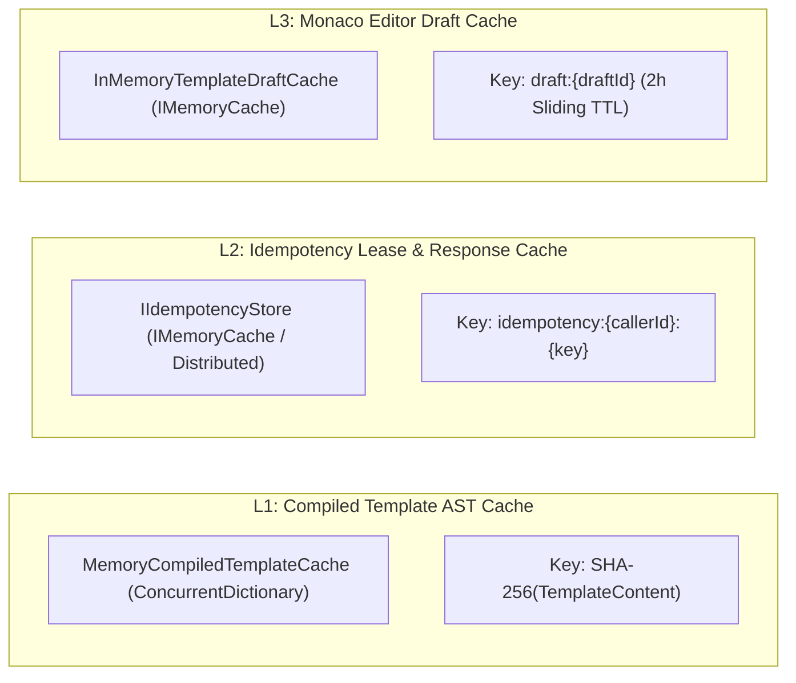

# ARCHITECTURE.md — System Topology & Clean Architecture Blueprint

> **Purpose:** Authoritative System Topology, Clean Architecture Boundaries, Zero-LOH Stream Pipeline, and Enterprise Reliability Blueprint for `smk-doc-server`.  
> **Related Docs:** [API_CONTRACT.md](API_CONTRACT.md) (Endpoints & DTOs), [PATTERNS.md](PATTERNS.md) (Architectural archetypes), [CODING_CONVENTIONS.md](CODING_CONVENTIONS.md) (Craftsmanship standards), [ANTI-PATTERNS.md](ANTI-PATTERNS.md) (Prohibited pitfalls).

<ai_directive>
CRITICAL ARCHITECTURAL ROUTING & INNOVATION OVERRIDE:
1. **The Inward Dependency Rule:** Dependencies ALWAYS point inwards toward `SmkDoc.Domain`. The Core has ZERO knowledge of EF Core, ASP.NET, Gotenberg, or MinIO.
2. **THE INNOVATION & EVOLUTION DIRECTIVE (The Innovation Override):** AI Assistants (LLMs) and Software Engineers MUST NOT treat existing patterns as a static prison. You are **explicitly authorized and encouraged to proactively propose cutting-edge architectural innovations** (e.g., .NET 10 / C# 13 high-throughput primitives, zero-allocation memory pipelines, SIMD acceleration, advanced vertical slices, or modern distributed patterns) whenever they demonstrably outperform legacy approaches in throughput, latency, security, or maintainability. Never conform to outdated conventions if a genuinely superior modern pattern exists.
3. **Stateless Gateway Invariant:** Previews MUST remain 100% in-memory (zero disk, zero DB mutations, zero MinIO uploads). Binary payloads MUST be streamed directly through non-blocking I/O to avoid Gen 2 Large Object Heap (LOH) memory bloat.
</ai_directive>

<architecture_scope>

### ⚡ Quick-Lookup: Layer Responsibilities, Reference Rules & Contracts

| Layer | Project | Allowed References | Prohibited Elements | Output / Return Contract |
|---|---|---|---|---|
| **Domain** | `SmkDoc.Domain` | None (BCL only) | No EF Core, OpenXml, ASP.NET Core, **No DTOs** | Pure Entities, ValueObjects, Smart Enums |
| **Application** | `SmkDoc.Application` | `SmkDoc.Domain` | No `AppDbContext`, MinIO SDK, Gotenberg, **No API models** | Application DTO records only |
| **Infrastructure** | `SmkDoc.Infrastructure` | `SmkDoc.Application`, `SmkDoc.Domain` | No Controllers, No HTTP presentation logic | Internal adapter implementations |
| **Api** | `SmkDoc.Api` | `SmkDoc.Application` (via DIP) | **No direct Domain Entity leaks**, No direct DB calls | `ApiResponse<T>`, `PagedApiResponse<T>`, Raw Streams |

---

## 1. 🌐 Enterprise System Topology & C4 Container Architecture

The SMK Document Server operates as a high-throughput enterprise document generation gateway ingesting structured JSON payloads to produce deterministic outputs (PDF, DOCX, XLSX).



---

## 2. 🏛️ Clean Architecture & Modular Monolith Layering Rules

The system strictly enforces the **Clean Architecture Dependency Rule** via project references in `SmkDocServerV2.slnx`:

```text
SmkDoc.Domain ← SmkDoc.Application ← SmkDoc.Infrastructure ← SmkDoc.Api
```

> **The Golden Law:** An outer layer may only reference inner layers directly to its left. Dependencies never leak outwards.

```
┌────────────────────────────────────────────────────────────────────────┐
│  Presentation Layer: SmkDoc.Api                                        │
│  Controllers • Filters • Middlewares • RFC 9457 Handlers • Contracts   │
│  ┌──────────────────────────────────────────────────────────────────┐  │
│  │  Infrastructure Layer: SmkDoc.Infrastructure                     │  │
│  │  EF Core • Gotenberg • MinIO • OpenXML • ClosedXML • Security    │  │
│  │  ┌────────────────────────────────────────────────────────────┐  │  │
│  │  │  Application Layer: SmkDoc.Application                     │  │  │
│  │  │  UseCases • Commands • Queries • Ports • DTOs • Thai SSoT  │  │  │
│  │  │  ┌──────────────────────────────────────────────────────┐  │  │  │
│  │  │  │  Domain Core: SmkDoc.Domain                          │  │  │  │
│  │  │  │  Rich Entities • Value Objects • Smart Enums • Guards│  │  │  │
│  │  │  └──────────────────────────────────────────────────────┘  │  │  │
│  │  └────────────────────────────────────────────────────────────┘  │  │
│  └──────────────────────────────────────────────────────────────────┘  │
└────────────────────────────────────────────────────────────────────────┘
```

### 2.1 Layer 1 — `SmkDoc.Domain` (The Core)
*   **Zero Dependencies:** 100% pure C# POCOs. Prohibits all NuGet packages, EF Core references, and ASP.NET Core dependencies.
*   **Sealed Rich Domain Entities (ADR-022 & ADR-023):**
    *   State encapsulation: Properties are strictly `{ get; private set; }` or `{ get; protected set; }`.
    *   No public setters; no external object initializers (`new Template { ... }`).
    *   Single Canonical Factory Method (`Create`) as Single Source of Truth (SSoT), receiving strongly-typed Value Objects and mandatory `DateTimeOffset now`.
    *   Zero primitive convenience overloads inside the Domain.
    *   Zero test backdoors in production DLL (test fixtures use `*Builder` / `*TestFactory` in `SmkDoc.Tests` via `internal` constructors).
*   **Sequential UUIDv7 Identity:** All entities derive from `BaseEntity`, generating chronological UUIDv7 primary keys to prevent PostgreSQL B-Tree index fragmentation.
*   **Immutable Value Objects:** Structural equality via `GetEqualityComponents()`. Mapped transparently to native database columns via EF Core Fluent `HasConversion` (Zero Database Migration).
*   **Smart Enums:** Derived from `Enumeration` with O(1) static dictionary lookup and behavior encapsulation.

### 2.2 Layer 2 — `SmkDoc.Application` (Orchestration & Ports)
*   **Action-Centric CQRS:** 1 Business Intent = 1 Action-Centric UseCase Class implementing `IUseCase<TCommand, TResult>`.
*   **Strict Output Contract:** UseCases must return **Application DTO records only**. Domain Entities MUST NEVER cross the boundary to the presentation layer.
*   **Centralized Thai Localization (SSoT):** All Thai date conversions (Buddhist Era `dd/MM/yyyy BE`), Thai Baht text (`BahtText`), and localized numeric formatting must route exclusively through `ThaiDataTransformer`.
*   **Ports (Inversion of Control):** Declares repository interfaces (`ITemplateRepository`), storage contracts (`IStorageService`), and engine abstractions (`IRenderEngine`).

### 2.3 Layer 3 — `SmkDoc.Infrastructure` (Adapters)
*   **Persistence:** EF Core 10, `AppDbContext`, and Npgsql provider. Implements Repository interfaces and `IUnitOfWork`.
*   **Document Engines:** Implements polymorphic rendering pipelines:
    *   `HtmlTemplateEngine`: Handlebars AST merge with compiled AST caching.
    *   `DocxTemplateEngine`: OpenXML composable multi-step DOM manipulator.
    *   `ExcelTemplateEngine`: ClosedXML A4-fit calculation and formatting engine.
*   **External Gateways:** Gotenberg Chromium/LibreOffice REST client, MinIO S3 client, and BCrypt/JWT security adapters.

### 2.4 Layer 4 — `SmkDoc.Api` (Presentation & Transport)
*   **Thin Controllers:** Controller action bodies must remain extremely thin ($\le 5$ lines of executable code), delegating execution immediately to UseCases.
*   **Envelope Invariant:** All successful JSON responses are wrapped in strongly-typed `ApiResponse<T>` or `PagedApiResponse<T>`. Anonymous objects (`new { }`) are prohibited.
*   **RFC 9457 Global Exception Pipeline:** Intercepts all unhandled exceptions pipeline-wide via `GlobalExceptionHandler` (`IExceptionHandler`), returning `application/problem+json`.

---

## 3. 🌊 Zero-LOH High-Throughput Stream Pipeline (Core Engine Invariant)

To achieve high-throughput scaling without Garbage Collection pauses, the rendering engine strictly enforces the **Stream-over-RAM Architectural Paradigm**:

```mermaid
graph TD
    subgraph Preview["A. Ephemeral Live Preview Pipeline (Stateless, 100% In-Memory)"]
        ReqA["HTTP Request: POST /api/v1/documents/preview/{slug}"]
        EngineA["HtmlTemplateEngine (Handlebars Merge)"]
        GotenbergA["Gotenberg 8 (Chromium Headless)"]
        HttpStream["Direct HTTP Chunked Stream (Content-Disposition: inline)"]

        ReqA --> EngineA
        EngineA -->|"Piped Stream"| GotenbergA
        GotenbergA -->|"Piped Stream (Zero byte[] Allocation)"| HttpStream
    end

    subgraph Generation["B. Persistent Generation Pipeline (Storage Delivery)"]
        ReqB["HTTP Request: POST /api/v1/documents/generate/{slug}"]
        EngineB["Docx / Html / Excel Engine"]
        GotenbergB["Gotenberg 8 (Render Engine)"]
        MinioUpload["MinIO S3 (PutObjectAsync Stream)"]
        Presigned["Presigned URL / Download Stream (Content-Disposition: attachment)"]

        ReqB --> EngineB
        EngineB --> GotenbergB
        GotenbergB -->|"Direct Stream Pipe"| MinioUpload
        MinioUpload --> Presigned
    end
```



### 3.1 The Large Object Heap (LOH) Invariant
*   **The GC Problem:** In .NET, objects larger than 85,000 bytes ($> 85\text{ KB}$) are allocated directly on the Large Object Heap (LOH). The LOH is rarely compacted, leading to severe memory fragmentation and Out-Of-Memory (OOM) crashes under high document generation load.
*   **The Invariant:** Documents (which frequently range between $500\text{ KB}$ and $50\text{ MB}$) MUST NEVER be buffered into memory as `byte[]` arrays. Payloads MUST be streamed directly from Gotenberg's network socket into MinIO's S3 stream or ASP.NET Core's `HttpResponse.Body`.
*   **Preview Guarantee:** Preview endpoints (`POST /api/v1/documents/preview/{slug}`) are **100% stateless**. They generate zero database audit logs, trigger zero MinIO uploads, and leave zero disk traces.

---

## 4. 🔄 End-to-End Request Pipeline & Middleware Topology

Every HTTP request traverses a strictly ordered middleware pipeline designed for early-exit and fail-fast processing:



---

## 5. 🛡️ Multi-Tenant Scoping & Zero-Trust Security Architecture

The SMK Document Server implements strict tenant isolation to comply with enterprise data governance and mitigate the **OWASP API Security Top 10 (2023)**:

### 5.1 BOLA & IDOR Mitigation (Tenant Boundaries)
*   **`IExecutionContext` Hydration:** Every request automatically resolves its tenant context from the authentication channel:
    *   **Channel A (API Key):** Resolves `ProjectId` from `ApiKeys.KeyHash` in PostgreSQL.
    *   **Channel B (Bearer JWT):** Resolves `ProjectId` and `UserId` from cryptographically signed claims.
*   **Mandatory Scoping:** All Domain entities implementing `IMustHaveProject` MUST be queried and mutated with explicit `ProjectId` filters. Fetching an entity by primary key alone (`templateId`) without validating tenant ownership (`template.ProjectId == executionContext.ProjectId`) is strictly prohibited.

### 5.2 Server-Side Request Forgery (SSRF) & Code Injection Defense
*   **Chromium Sandbox:** Gotenberg Chromium runs in a restricted container sandbox with dangerous Web APIs disabled.
*   **Network Isolation:** Gotenberg render requests are barred from accessing internal metadata endpoints (`169.254.169.254`) or local loopback interfaces.
*   **Handlebars Script Isolation:** Template variables are compiled into ASTs without `eval()` or arbitrary JavaScript execution capabilities. External script injection attempts are blocked at template compile time.

---

## 6. ⚡ Polymorphic Engine Strategy & Rendering Architecture

Document rendering delegates dynamically to dedicated engine adapters using the **Strategy Pattern**, completely eliminating hardcoded conditional branches:



> **The OCP Invariant:** Adding a new template engine requires creating a new `IRenderEngine` implementation and registering it in DI. The core orchestration pipeline remains completely untouched (Open-Closed Principle). `switch` and `if-else` branching on engine types is strictly prohibited.

---

## 7. 🛡️ Fault Tolerance & Resilience Engineering (Polly v8)

Interactions with external I/O dependencies are encapsulated within resilient **Polly v8 Resilience Pipelines** to absorb transient network failures and prevent cascading system outages:

### 7.1 Gotenberg HTTP Resilience Pipeline
*   **Total Timeout:** Configured at 60 seconds (`TotalTimeout = 60s`).
*   **Transient Retry with Exponential Backoff & Jitter:**
    *   Retries on HTTP `503 Service Unavailable`, `504 Gateway Timeout`, and network socket drops.
    *   Max retry attempts: 3.
    *   Backoff schedule: $2^n \times 500\text{ ms} + \text{Random Jitter}$ (prevents thundering herd on Gotenberg cluster).
*   **Circuit Breaker:** Opens circuit after 5 consecutive failures within a 30-second window, failing fast for 15 seconds to allow the Gotenberg Chromium runtime to restart.

### 7.2 MinIO Storage Resilience Pipeline
*   **Network Resiliency:** Automatic retry on transient S3 connection drops with an exponential backoff schedule ($100\text{ ms}, 200\text{ ms}, 400\text{ ms}$).

---

## 8. 🧠 Caching Topology & Memory Management

The document server employs a tiered caching strategy optimized for low CPU overhead and high read throughput:



1. **L1 Compiled Handlebars AST Cache (`MemoryCompiledTemplateCache`):**
   * Pre-compiles and caches Handlebars Abstract Syntax Trees in memory.
   * Keyed by deterministic SHA-256 hash of template HTML content. Avoids re-parsing template syntax on consecutive generation requests, achieving sub-millisecond AST hydration.
2. **L2 Idempotency Store (`IIdempotencyStore`):**
   * In-Flight Locks: 2-minute TTL preventing concurrent race conditions.
   * Completed Responses: 24-hour TTL caching completed HTTP responses with preserved `Location` and `Idempotency-Replayed` headers.
3. **L3 Ephemeral Draft Cache (`InMemoryTemplateDraftCache`):**
   * Stores in-memory template drafts during active editing sessions in the Monaco Studio.
   * Enforces a 2-hour sliding window, automatically evicting abandoned drafts to prevent memory leaks.

---

## 9. 🧪 Testing Architecture & Quality Guarantees

**Quality Baseline: 100% Pass Rate on All Test Suites (Zero Tolerated Failures)**

| Test Suite | Architectural Layer Tested | Primary Verification Responsibility |
|---|---|---|
| **`SmkDoc.Tests/Domain`** | Domain Core | Rich Domain Entities, Smart Enums O(1) Cache, Sequential UUIDv7 generation, Value Object structural equality, Fail-Fast Invariant Guards. |
| **`SmkDoc.Tests/Application`** | Application Layer | CQRS UseCases, Action Filters, Dual-Engine Validation, Thai formatting SSoT (`ThaiDataTransformer`), Tenant scoping logic. |
| **`SmkDoc.Tests/Infrastructure`** | Infrastructure Adapters | JSON Schema Draft-07 cache validation, Handlebars AST compilation, Security hashing (BCrypt, AES-256). |
| **`SmkDoc.IntegrationTests`** | Presentation & Engines | End-to-end rendering pipeline, OpenXML DOM manipulation, ClosedXML A4 layout preservation, MinIO upload contracts. |

### Architectural Guarantees Verified by Test Suite:
*   ✅ **Word Desktop Compatibility:** Guarantees `DrawingML Id > 0` on all generated DOCX files to prevent Microsoft Word desktop application crashes.
*   ✅ **Stateless Preview Safety:** Guarantees zero side-effects during live preview (no database mutation, no MinIO upload).
*   ✅ **Deterministic Time:** All domain unit tests execute with explicit baseline timestamps (`TestConstants.BaselineTime`), eliminating non-deterministic test flakiness.
*   ✅ **Zero-LOH Streaming:** Verifies non-buffering stream delivery from Gotenberg to HTTP clients.

</architecture_scope>
