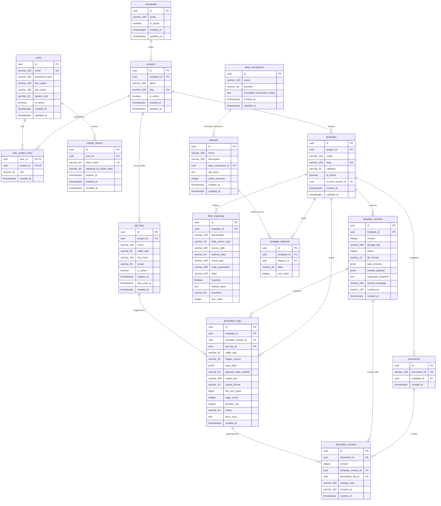

# DB_SCHEMA.md — PostgreSQL Relational Schema & Tables

> **Purpose:** Authoritative PostgreSQL relational schema definition, UUIDv7 PK types, foreign keys, index strategy, Domain Value Object mappings, and JSONB contracts for `smk-doc-server`.  
> **Related Docs:** [ARCHITECTURE.md](ARCHITECTURE.md) (Persistence layer & system topology), [PROJECT_STRUCTURE.md](PROJECT_STRUCTURE.md) (Domain entities), [PATTERNS.md](PATTERNS.md) (Clean Architecture archetypes), [CODING_CONVENTIONS.md](CODING_CONVENTIONS.md) (Naming standards), [ANTI-PATTERNS.md](ANTI-PATTERNS.md) (Persistence pitfalls).

<ai_directive>
CRITICAL ATTENTION ROUTING & PERSISTENCE CONSTRAINTS:
1. **The Inward Dependency Rule:** The Database schema serves the Domain Core (`SmkDoc.Domain`). Domain Entities NEVER adapt to database quirks; EF Core Fluent API mappings adapt the database to the rich domain model.
2. **Strict Sequential UUIDv7 Identity:** Primary keys MUST be generated in the C# Application/Domain layer using `BaseEntity` / `Guid.CreateVersion7()`. Database columns are standard `UUID` without DB-side `gen_random_uuid()` to prevent B-Tree index page-splitting fragmentation.
3. **Mandatory Foreign Key Indexes:** PostgreSQL does NOT index foreign keys automatically. Every foreign key column MUST have an explicit `CREATE INDEX` to prevent sequential scans on JOINs and cascading deletes.
4. **Value Object Persistence via HasConversion:** Domain Value Objects (e.g., `TemplateName`, `Sha256Hash`, `EmailAddress`) MUST be persisted via EF Core Fluent `.HasConversion()` to native SQL primitives.
5. **Soft Deletes via is_active:** Soft deletion uses `is_active BOOLEAN DEFAULT true` (not `deleted_at`). Queries are scoped via EF Core Global Query Filters (`builder.HasQueryFilter(e => e.IsActive)`).
</ai_directive>

<database_scope>

### ⚡ Quick-Lookup: Authoritative 15-Table Catalog

| # | Table Name | Entity Class | Primary Key | Foreign Keys & Targets | Soft Delete | Performance Indexes & Constraints |
|---|---|---|---|---|---|---|
| 1 | `companies` | `Company` | UUIDv7 | None | `is_active` | PK |
| 2 | `projects` | `Project` | UUIDv7 | `company_id` → `companies(id)` [CASCADE] | `is_active` | `(slug)` UNIQUE, `(company_id)` FK |
| 3 | `users` | `User` | UUIDv7 | None | `is_active` | `(email)` UNIQUE |
| 4 | `user_project_roles` | `UserProjectRole` | `(user_id, project_id)` | `user_id` → `users(id)` [CASCADE]<br>`project_id` → `projects(id)` [CASCADE] | None | PK composite, `(project_id)` FK |
| 5 | `refresh_tokens` | `RefreshToken` | UUIDv7 | `user_id` → `users(id)` [CASCADE] | None | `(token_hash)` UNIQUE, `(user_id, expires_at)` PARTIAL INDEX `WHERE revoked_at IS NULL` |
| 6 | `templates` | `Template` | UUIDv7 | `project_id` → `projects(id)` [CASCADE]<br>`current_version_id` → `template_versions(id)` [SET NULL] | `is_active` | `(slug)` UNIQUE, `(project_id)` FK |
| 7 | `template_versions` | `TemplateVersion` | UUIDv7 | `template_id` → `templates(id)` [CASCADE] | None | `(template_id, version)` UNIQUE, `(template_id)` FK |
| 8 | `field_mappings` | `FieldMapping` | UUIDv7 | `template_id` → `templates(id)` [CASCADE] | None | `(template_id, placeholder)` UNIQUE, `(template_id)` FK |
| 9 | `data_connections` | `DataConnection` | UUIDv7 | None | None | PK |
| 10 | `datasets` | `Dataset` | UUIDv7 | `data_connection_id` → `data_connections(id)` [RESTRICT] | None | `(data_connection_id)` FK |
| 11 | `template_datasets` | `TemplateDataset` | UUIDv7 | `template_id` → `templates(id)` [CASCADE]<br>`dataset_id` → `datasets(id)` [RESTRICT] | None | `(template_id, alias)` UNIQUE, `(template_id)` FK, `(dataset_id)` FK |
| 12 | `api_keys` | `ApiKey` | UUIDv7 | `project_id` → `projects(id)` [CASCADE] | `is_active` | `(project_id)` FK, `(key_hash)` INDEX |
| 13 | `generation_logs` | `GenerationLog` | UUIDv7 | `template_id` → `templates(id)` [SET NULL]<br>`template_version_id` → `template_versions(id)` [SET NULL]<br>`api_key_id` → `api_keys(id)` [SET NULL] | None | `(created_at DESC)` INDEX, FK indexes |
| 14 | `documents` | `Document` | UUIDv7 | `template_id` → `templates(id)` [SET NULL] | None | `(document_ref)` UNIQUE, `(template_id)` FK |
| 15 | `document_versions` | `DocumentVersion` | UUIDv7 | `document_id` → `documents(id)` [CASCADE]<br>`template_version_id` → `template_versions(id)` [SET NULL]<br>`generation_log_id` → `generation_logs(id)` [SET NULL] | None | `(document_id, version)` UNIQUE, FK indexes |

---

## 1. 📊 Enterprise Entity-Relationship Diagram (Mermaid ERD)

The database schema is organized into 4 cohesive bounded clusters:



---

## 2. 🛡️ Clean Architecture Persistence Matrix (Domain POCO → PostgreSQL Column)

The Persistence Layer (`SmkDoc.Infrastructure`) bridges the pure domain model (`SmkDoc.Domain`) to PostgreSQL via EF Core 10 Fluent API configurations. No domain classes leak database or EF Core dependencies.

### 2.1 Domain Value Object Persistence Mappings

| Domain Value Object | Target Table & Column | SQL Primitive Column Type | EF Core Conversion (`.HasConversion()`) |
|---|---|---|---|
| `CompanyName` | `companies.name` | `VARCHAR(200)` | `n => n.Value, v => CompanyName.Create(v)` |
| `ProjectName` | `projects.name` | `VARCHAR(200)` | `n => n.Value, v => ProjectName.Create(v)` |
| `TemplateName` | `templates.name` | `VARCHAR(100)` | `v => v.Value, v => TemplateName.Create(v)` |
| `TemplateSlug` | `projects.slug`, `templates.slug` | `VARCHAR(100)` | `s => s.Value, v => new TemplateSlug(v)` |
| `EmailAddress` | `users.email` | `VARCHAR(255)` | `m => m.Value, v => EmailAddress.Create(v)` |
| `Sha256Hash` | `refresh_tokens.token_hash`<br>`api_keys.key_hash`<br>`generation_logs.payload_hash_sha256` | `VARCHAR(64)`<br>`VARCHAR(255)`<br>`VARCHAR(64)` | `h => h.Value, v => new Sha256Hash(v)` |
| `ApiKeyName` | `api_keys.name` | `VARCHAR(100)` | `v => v.Value, v => ApiKeyName.Create(v)` |
| `ExpirationPolicy` | `api_keys.expires_at` | `TIMESTAMPTZ` | `v => v.ExpiresAt, v => ExpirationPolicy.FromExisting(v)` |
| `DocumentReference` | `documents.document_ref` | `VARCHAR(100)` | `d => d.Value, v => DocumentReference.Create(v)` |
| `ConnectionName` | `data_connections.name` | `VARCHAR(100)` | `v => v.Value, v => ConnectionName.Create(v)` |
| `DatasetName` | `datasets.name` | `VARCHAR(200)` | `v => v.Value, v => DatasetName.Create(v)` |
| `DatasetAlias` | `field_mappings.dataset_alias`<br>`template_datasets.alias` | `VARCHAR(50)` | `a => a.Value, v => DatasetAlias.Create(v)` |

### 2.2 Smart Enum Persistence Mappings

All Smart Enums derive from `Enumeration` with O(1) static dictionary lookup:

| Smart Enum | Target Table & Column | Storage Type | EF Core Conversion | Default Value |
|---|---|---|---|---|
| `SystemRole` | `users.system_role` | `VARCHAR(30)` | `r => r.Name, v => SystemRole.FromDisplayName<SystemRole>(v)` | `'Member'` |
| `RoleType` | `user_project_roles.role` | `VARCHAR(20)` | `r => r.Name, v => RoleType.FromDisplayName<RoleType>(v)` | None (Required) |
| `ApiKeyScope` | `api_keys.scope` | `VARCHAR(20)` | `s => s.Name, v => ApiKeyScope.FromDisplayName<ApiKeyScope>(v)` | `'ReadWrite'` |
| `TemplateVersionStatus` | `template_versions.status` | `INTEGER` | `s => s.Id, v => TemplateVersionStatus.FromValue<TemplateVersionStatus>(v)` | `0` (`Draft`) |
| `TemplateFormat` | `template_versions.file_format` | `VARCHAR(10)` | `f => f.Name, v => TemplateFormat.FromDisplayName<TemplateFormat>(v)` | `NULL` |
| `OutputFormat` | `generation_logs.output_format` | `VARCHAR(10)` | `f => f.Name, v => OutputFormat.FromDisplayName<OutputFormat>(v)` | `NULL` |
| `GenerationStatus` | `generation_logs.status` | `VARCHAR(20)` | `s => s.Name, v => GenerationStatus.FromName(v)` | `'Success'` |
| `DataSourceType` | `field_mappings.data_source_type` | `VARCHAR(20)` | `d => d.Value, v => DataSourceType.FromString(v)` | `'json'` |
| `DatabaseProvider` | `data_connections.provider` | `VARCHAR(50)` | `p => p.Name, v => Enumeration.FromDisplayName<DatabaseProvider>(v)` | None (Required) |

> **Note on `TemplateVersionStatus` Storage:** Unlike general string-based Smart Enums, `TemplateVersionStatus` is stored as `INTEGER` (`0 = Draft`, `1 = Published`, `2 = Archived`) in accordance with active EF Core database migration `WaveTwo_FullSchemaRebuild` and `AppDbContext.cs`.

---

## 3. 🚀 High-Throughput Indexing & Multi-Tenant Strategy

### 3.1 Sequential UUIDv7 Identity vs UUIDv4 B-Tree Fragmentation
*   **The Invariant:** Primary keys are strictly generated as time-ordered **UUIDv7** by `BaseEntity` (`Guid.CreateVersion7()`).
*   **PostgreSQL B-Tree Benefit:** Standard random UUIDv4 causes continuous page-splitting across the entire depth of the B-Tree index, leading to index bloat and high disk I/O. UUIDv7 contains a 48-bit millisecond unix timestamp prefix, guaranteeing monotonic index append locality, reducing cache thrashing, and keeping index write operations fast.

### 3.2 High-Performance Partial (Filtered) Indexes
PostgreSQL partial indexes index only relevant subsets of rows, saving substantial disk space and accelerating hot-path queries:
*   **Active Refresh Tokens Index:**
    ```sql
    CREATE INDEX idx_refresh_tokens_user_expires 
    ON refresh_tokens(user_id, expires_at) 
    WHERE revoked_at IS NULL;
    ```
    Allows token validation queries (`WHERE user_id = @id AND revoked_at IS NULL`) to completely bypass revoked token historical rows.

### 3.3 Multi-Tenant Isolation Composite Indexes
*   **Tenant Scoping Invariant:** Every query in the application filters by tenant context (`ProjectId`).
*   **Critical Composite Keys:**
    *   `projects`: `(slug)` UNIQUE
    *   `templates`: `(slug)` UNIQUE + `(project_id)` FK Index
    *   `template_versions`: `(template_id, version)` UNIQUE
    *   `field_mappings`: `(template_id, placeholder)` UNIQUE
    *   `template_datasets`: `(template_id, alias)` UNIQUE
    *   `generation_logs`: `(created_at DESC)` Index for chronological log paging

---

## 4. 🗄️ Authoritative DDL Specification (PostgreSQL 16+)

```sql
-- ============================================================================
-- 0. MULTI-TENANCY & AUTHENTICATION CLUSTER
-- ============================================================================

CREATE TABLE companies (
    id         UUID PRIMARY KEY, -- UUIDv7 Generated by C# Application
    name       VARCHAR(200) NOT NULL,
    is_active  BOOLEAN NOT NULL DEFAULT true,
    created_at TIMESTAMPTZ NOT NULL DEFAULT NOW(),
    updated_at TIMESTAMPTZ
);

CREATE TABLE projects (
    id         UUID PRIMARY KEY,
    company_id UUID NOT NULL REFERENCES companies(id) ON DELETE CASCADE,
    name       VARCHAR(200) NOT NULL,
    slug       VARCHAR(100) UNIQUE NOT NULL,
    is_active  BOOLEAN NOT NULL DEFAULT true,
    created_at TIMESTAMPTZ NOT NULL DEFAULT NOW(),
    updated_at TIMESTAMPTZ
);
CREATE INDEX idx_projects_company_id ON projects(company_id);

CREATE TABLE users (
    id            UUID PRIMARY KEY,
    email         VARCHAR(255) UNIQUE NOT NULL,
    password_hash VARCHAR(255) NOT NULL,
    first_name    VARCHAR(100) NOT NULL,
    last_name     VARCHAR(100) NOT NULL,
    system_role   VARCHAR(30) NOT NULL DEFAULT 'Member', -- 'SuperAdmin', 'Member', 'Viewer'
    is_active     BOOLEAN NOT NULL DEFAULT true,
    created_at    TIMESTAMPTZ NOT NULL DEFAULT NOW(),
    updated_at    TIMESTAMPTZ
);

CREATE TABLE refresh_tokens (
    id                     UUID PRIMARY KEY,
    user_id                UUID NOT NULL REFERENCES users(id) ON DELETE CASCADE,
    token_hash             VARCHAR(64) UNIQUE NOT NULL,
    expires_at             TIMESTAMPTZ NOT NULL,
    created_at             TIMESTAMPTZ NOT NULL DEFAULT NOW(),
    revoked_at             TIMESTAMPTZ,
    replaced_by_token_hash VARCHAR(64)
);
CREATE INDEX idx_refresh_tokens_user_id ON refresh_tokens(user_id);
CREATE INDEX idx_refresh_tokens_user_expires ON refresh_tokens(user_id, expires_at) WHERE revoked_at IS NULL;

CREATE TABLE user_project_roles (
    user_id    UUID NOT NULL REFERENCES users(id) ON DELETE CASCADE,
    project_id UUID NOT NULL REFERENCES projects(id) ON DELETE CASCADE,
    role       VARCHAR(20) NOT NULL, -- 'Admin', 'Editor', 'Viewer'
    created_at TIMESTAMPTZ NOT NULL DEFAULT NOW(),
    PRIMARY KEY (user_id, project_id)
);
CREATE INDEX idx_user_project_roles_project_id ON user_project_roles(project_id);


-- ============================================================================
-- 1. TEMPLATE CATALOG & MAPPING CLUSTER
-- ============================================================================

CREATE TABLE templates (
    id                 UUID PRIMARY KEY,
    project_id         UUID NOT NULL REFERENCES projects(id) ON DELETE CASCADE,
    name               VARCHAR(100) NOT NULL,
    slug               VARCHAR(100) UNIQUE NOT NULL,
    category           VARCHAR(50),
    is_active          BOOLEAN NOT NULL DEFAULT true,
    current_version_id UUID, -- Foreign Key to template_versions added after table creation
    created_at         TIMESTAMPTZ NOT NULL DEFAULT NOW(),
    updated_at         TIMESTAMPTZ NOT NULL DEFAULT NOW()
);
CREATE INDEX idx_templates_project_id ON templates(project_id);

CREATE TABLE template_versions (
    id                UUID PRIMARY KEY,
    template_id       UUID NOT NULL REFERENCES templates(id) ON DELETE CASCADE,
    version           INTEGER NOT NULL,
    storage_key       VARCHAR(500) NOT NULL,
    status            INTEGER NOT NULL DEFAULT 0, -- 0: Draft, 1: Published, 2: Archived
    file_format       VARCHAR(10),                -- 'Html', 'Word', 'Excel'
    data_schema       JSONB,                      -- JSON Schema Draft-07
    sample_payload    JSONB,                      -- Sample mock payload for editor testing
    mappings_snapshot TEXT,                       -- JSON string snapshot of FieldMappings
    commit_message    VARCHAR(500),
    created_by        VARCHAR(100),
    created_at        TIMESTAMPTZ NOT NULL DEFAULT NOW(),
    UNIQUE(template_id, version)
);
CREATE INDEX idx_template_versions_template_id ON template_versions(template_id);

-- Deferred circular foreign key for current active version
ALTER TABLE templates 
    ADD CONSTRAINT fk_templates_current_version_id 
    FOREIGN KEY (current_version_id) 
    REFERENCES template_versions(id) 
    ON DELETE SET NULL;

CREATE TABLE field_mappings (
    id               UUID PRIMARY KEY,
    template_id      UUID NOT NULL REFERENCES templates(id) ON DELETE CASCADE,
    placeholder      VARCHAR(100) NOT NULL,
    data_source_type VARCHAR(20) NOT NULL DEFAULT 'json', -- 'json', 'sql', 'expression'
    source_path      VARCHAR(200) NOT NULL,
    dataset_alias    VARCHAR(50),
    result_path      VARCHAR(300),
    math_expression  VARCHAR(500),
    label            VARCHAR(200) NOT NULL,
    required         BOOLEAN NOT NULL DEFAULT false,
    default_value    TEXT,
    transform        VARCHAR(50),
    sort_order       INTEGER NOT NULL DEFAULT 0,
    UNIQUE(template_id, placeholder)
);
CREATE INDEX idx_field_mappings_template_id ON field_mappings(template_id);


-- ============================================================================
-- 2. EXTERNAL DATASOURCES & SQL DATASETS CLUSTER
-- ============================================================================

CREATE TABLE data_connections (
    id                          UUID PRIMARY KEY,
    name                        VARCHAR(100) NOT NULL,
    provider                    VARCHAR(50) NOT NULL, -- 'PostgreSql', 'SqlServer', 'MySql', 'Oracle'
    encrypted_connection_string TEXT NOT NULL,
    created_at                  TIMESTAMPTZ NOT NULL DEFAULT NOW(),
    updated_at                  TIMESTAMPTZ
);

CREATE TABLE datasets (
    id                 UUID PRIMARY KEY,
    name               VARCHAR(200) NOT NULL,
    description        VARCHAR(500),
    data_connection_id UUID NOT NULL REFERENCES data_connections(id) ON DELETE RESTRICT,
    sql_query          TEXT NOT NULL,
    cache_seconds      INTEGER NOT NULL DEFAULT 0,
    created_at         TIMESTAMPTZ NOT NULL DEFAULT NOW(),
    updated_at         TIMESTAMPTZ
);
CREATE INDEX idx_datasets_data_connection_id ON datasets(data_connection_id);

CREATE TABLE template_datasets (
    id          UUID PRIMARY KEY,
    template_id UUID NOT NULL REFERENCES templates(id) ON DELETE CASCADE,
    dataset_id  UUID NOT NULL REFERENCES datasets(id) ON DELETE RESTRICT,
    alias       VARCHAR(50) NOT NULL,
    sort_order  INTEGER NOT NULL DEFAULT 0,
    UNIQUE(template_id, alias)
);
CREATE INDEX idx_template_datasets_template_id ON template_datasets(template_id);
CREATE INDEX idx_template_datasets_dataset_id ON template_datasets(dataset_id);


-- ============================================================================
-- 3. SECURITY & AUDIT TRAIL CLUSTER
-- ============================================================================

CREATE TABLE api_keys (
    id           UUID PRIMARY KEY,
    project_id   UUID NOT NULL REFERENCES projects(id) ON DELETE CASCADE,
    name         VARCHAR(100) NOT NULL,
    caller_app   VARCHAR(50) NOT NULL,
    key_hash     VARCHAR(255) NOT NULL,
    expires_at   TIMESTAMPTZ, -- Expiration policy timestamp
    scope        VARCHAR(20) NOT NULL DEFAULT 'ReadWrite', -- 'ReadOnly', 'ReadWrite'
    is_active    BOOLEAN NOT NULL DEFAULT true,
    last_used_at TIMESTAMPTZ,
    created_at   TIMESTAMPTZ NOT NULL DEFAULT NOW()
);
CREATE INDEX idx_api_keys_project_id ON api_keys(project_id);
CREATE INDEX idx_api_keys_key_hash ON api_keys(key_hash);

CREATE TABLE generation_logs (
    id                  UUID PRIMARY KEY,
    template_id         UUID REFERENCES templates(id) ON DELETE SET NULL,
    template_version_id UUID REFERENCES template_versions(id) ON DELETE SET NULL,
    api_key_id          UUID REFERENCES api_keys(id) ON DELETE SET NULL,
    caller_app          VARCHAR(50),
    trigger_source      VARCHAR(20),
    input_data          JSONB,
    payload_hash_sha256 VARCHAR(64),
    output_key          VARCHAR(500),
    output_format       VARCHAR(10),
    file_size_bytes     BIGINT,
    page_count          INTEGER,
    duration_ms         INTEGER NOT NULL,
    status              VARCHAR(20) NOT NULL, -- 'Success', 'Failed', 'Timeout'
    error_msg           TEXT,
    created_at          TIMESTAMPTZ NOT NULL DEFAULT NOW()
);
CREATE INDEX idx_generation_logs_template_id ON generation_logs(template_id);
CREATE INDEX idx_generation_logs_template_version_id ON generation_logs(template_version_id);
CREATE INDEX idx_generation_logs_api_key_id ON generation_logs(api_key_id);
CREATE INDEX idx_generation_logs_created_at_desc ON generation_logs(created_at DESC);


-- ============================================================================
-- 4. LEGAL AUDIT TRAIL & DOCUMENT ARCHIVE CLUSTER
-- ============================================================================

CREATE TABLE documents (
    id           UUID PRIMARY KEY,
    document_ref VARCHAR(100) UNIQUE NOT NULL,
    template_id  UUID REFERENCES templates(id) ON DELETE SET NULL,
    created_at   TIMESTAMPTZ NOT NULL DEFAULT NOW()
);
CREATE INDEX idx_documents_template_id ON documents(template_id);

CREATE TABLE document_versions (
    id                  UUID PRIMARY KEY,
    document_id         UUID NOT NULL REFERENCES documents(id) ON DELETE CASCADE,
    version             INTEGER NOT NULL,
    template_version_id UUID REFERENCES template_versions(id) ON DELETE SET NULL,
    generation_log_id   UUID REFERENCES generation_logs(id) ON DELETE SET NULL,
    change_note         VARCHAR(500),
    created_by          VARCHAR(100),
    created_at          TIMESTAMPTZ NOT NULL DEFAULT NOW(),
    UNIQUE(document_id, version)
);
CREATE INDEX idx_document_versions_document_id ON document_versions(document_id);
CREATE INDEX idx_document_versions_template_version_id ON document_versions(template_version_id);
CREATE INDEX idx_document_versions_generation_log_id ON document_versions(generation_log_id);
```

---

## 5. 📋 JSONB Schema Contracts & Strict Payloads

PostgreSQL `JSONB` columns store structured documents with binary indexing and validation capabilities:

### 5.1 `template_versions.data_schema` (JSON Schema Draft-07)
Stores the authoritative structural schema against which incoming generation payloads are strictly validated before rendering:

```json
{
  "$schema": "http://json-schema.org/draft-07/schema#",
  "title": "InvoicePayload",
  "type": "object",
  "required": ["invoiceNumber", "issueDate", "customer", "items"],
  "properties": {
    "invoiceNumber": { "type": "string", "minLength": 1 },
    "issueDate": { "type": "string", "format": "date-time" },
    "customer": {
      "type": "object",
      "required": ["name", "taxId"],
      "properties": {
        "name": { "type": "string" },
        "taxId": { "type": "string" }
      }
    },
    "items": {
      "type": "array",
      "minItems": 1,
      "items": {
        "type": "object",
        "required": ["description", "quantity", "unitPrice"],
        "properties": {
          "description": { "type": "string" },
          "quantity": { "type": "number", "minimum": 1 },
          "unitPrice": { "type": "number", "minimum": 0 }
        }
      }
    }
  }
}
```

### 5.2 `generation_logs.input_data` (Sanitized Request Payload Snapshot)
Stores a complete, sanitized snapshot of the generation parameters used to produce the document for regulatory auditing:

```json
{
  "invoiceNumber": "INV-2026-0091",
  "issueDate": "2026-10-10T02:00:00Z",
  "customer": {
    "name": "Acme Corporation",
    "taxId": "0105558123456"
  },
  "items": [
    { "description": "Cloud Document Server License", "quantity": 1, "unitPrice": 45000.00 }
  ],
  "_metadata": {
    "callerApp": "ERP-Billing",
    "ipAddress": "192.168.1.50"
  }
}
```

</database_scope>
