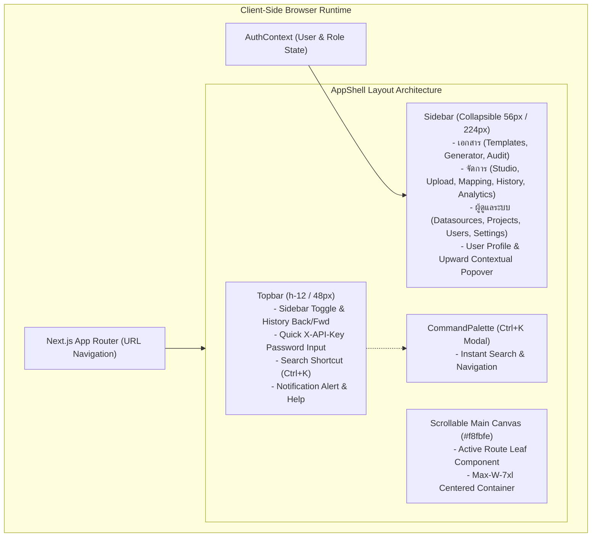
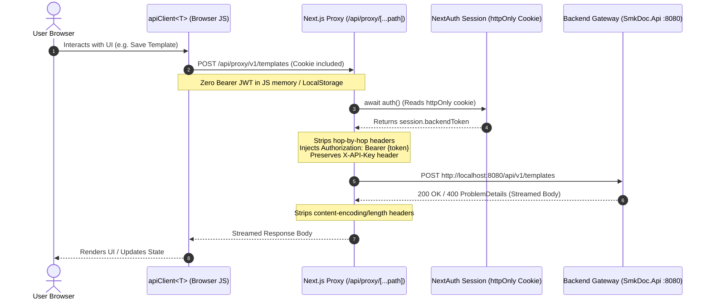

# FRONTEND_SPEC.md — Frontend Screen Specifications & Stitching Recipes

> **Purpose:** Authoritative UX specification, Screen Inventory, ASCII Wireframes, and Layout Stitching Recipes for `frontend-v2/`. Connects visual design tokens in [`DESIGN.md`](file:///c:/Users/jossl.000/Downloads/Compressed/smk-doc-server/smk-doc-server/docs/AI/DESIGN.md) to deterministic page assembly.  
> **Related Docs:** [DESIGN.md](file:///c:/Users/jossl.000/Downloads/Compressed/smk-doc-server/smk-doc-server/docs/AI/DESIGN.md), [CODING_CONVENTIONS.md](file:///c:/Users/jossl.000/Downloads/Compressed/smk-doc-server/smk-doc-server/docs/AI/CODING_CONVENTIONS.md), [API_CONTRACT.md](file:///c:/Users/jossl.000/Downloads/Compressed/smk-doc-server/smk-doc-server/docs/AI/API_CONTRACT.md), [PATTERNS.md](file:///c:/Users/jossl.000/Downloads/Compressed/smk-doc-server/smk-doc-server/docs/AI/PATTERNS.md).

<ai_directive>
CRITICAL ATTENTION ROUTING & BI-DIRECTIONAL AI TRIGGERS:

This document defines how frontend views are structured, assembled, and stitched together in Next.js (`frontend-v2/`).

🔄 TRIGGER A — SCREEN CREATION & MUTATION (MANDATORY VERIFICATION):
Whenever generating or editing page components, views, or layouts:
1. You MUST verify that all visual elements strictly adhere to the design tokens and atomic primitives in `DESIGN.md`.
2. Prohibit emitting raw inline HTML tags (`<button>`, `<input>`, unstyled table elements) or arbitrary hex colors. Always assemble pages by "stitching" atomic primitives from `@/components/ui/` (`Button`, `Badge`, `CardBlock`, `Input`, `Table`, `Toolbar`, `Pagination`).
3. Follow the designated "Stitching Recipe" and ASCII Wireframe for the target screen.

🔄 TRIGGER B — DESIGN SYSTEM SYNCHRONIZATION (APPROVAL GATE):
Whenever `DESIGN.md` design tokens, geometry rules, or atomic components are modified:
- You MUST proactively ask the user:
  "พบการปรับปรุง Design Tokens ใน `DESIGN.md` — ต้องการให้อัปเดต Screen Recipes ใน `FRONTEND_SPEC.md` ให้สอดคล้องกันด้วยหรือไม่?"
</ai_directive>

<frontend_spec_scope>

---

## 🏛️ System Architecture & Layout Topology



### 1. Secure Server-Side API Proxy Architecture

The browser client **never** stores or handles the backend Bearer JWT. The client communicates strictly with the Next.js server route handler, which translates secure httpOnly session cookies into upstream bearer tokens:



### 2. Monaco Studio v2 Interactive Live Preview Pipeline

Delivers real-time feedback with zero UI freezing, handling large HTML templates and Handlebars data binding through an asynchronous debounced pipeline:

```mermaid
sequenceDiagram
    autonumber
    actor Editor as Template Designer
    participant Monaco as Monaco Editor (@monaco-editor/react)
    participant Extractor as variableExtractor.ts
    participant Hook as useLivePreview Hook
    participant Proxy as Next.js API Proxy
    participant Backend as Gotenberg & Template Engine

    Editor->>Monaco: Types HTML / Handlebars syntax
    Monaco->>Extractor: html changed
    Extractor-->>Editor: Auto-extracts {{variables}} into sample JSON payload
    Monaco->>Hook: html & sampleDataJson updated
    Note over Hook: Debounce timer started (800ms)
    Editor->>Monaco: Additional keystroke within 800ms
    Note over Hook: Timer reset; in-flight AbortController.abort() called
    Note over Hook: 800ms idle elapsed
    Hook->>Proxy: POST /api/proxy/v1/documents/preview/{slug}
    Proxy->>Backend: Render HTML payload via Gotenberg
    Backend-->>Proxy: Binary PDF Stream
    Proxy-->>Hook: Blob (Content-Type: application/pdf)
    Note over Hook: URL.revokeObjectURL(previousUrl)<br/>newUrl = URL.createObjectURL(blob)<br/>Calculates renderLatencyMs & contentSizeBytes
    Hook-->>Editor: PdfPreviewPanel renders iframe with live PDF + APM badge
```

---

## 🛡️ Role-Based Access Control (RBAC) Matrix

Frontend permissions mirror the backend security domain and are enforced via [`frontend-v2/src/lib/rbac.ts`](file:///c:/Users/jossl.000/Downloads/Compressed/smk-doc-server/smk-doc-server/frontend-v2/src/lib/rbac.ts):

| Section | Route ID | Route Path | Min Role | Viewer (1) | Editor (2) | Admin (3) |
|---|---|---|---|:---:|:---:|:---:|
| **เอกสาร** | `templates` | `/templates` | Editor | ❌ | ✅ | ✅ |
| **เอกสาร** | `generator` | `/generator` | Viewer | ✅ | ✅ | ✅ |
| **เอกสาร** | `audit` | `/audit` | Viewer | ✅ | ✅ | ✅ |
| **เอกสาร** | `logs` | `/logs` | Admin | ❌ | ❌ | ✅ |
| **จัดการ** | `studio` | `/studio/[templateId]` | Editor | ❌ | ✅ | ✅ |
| **จัดการ** | `upload` | `/upload` | Editor | ❌ | ✅ | ✅ |
| **จัดการ** | `mapping` | `/mapping` | Editor | ❌ | ✅ | ✅ |
| **จัดการ** | `version-history`| `/version-history` | Editor | ❌ | ✅ | ✅ |
| **จัดการ** | `analytics` | `/analytics` | Admin | ❌ | ❌ | ✅ |
| **ผู้ดูแลระบบ** | `datasources` | `/datasources` | Admin | ❌ | ❌ | ✅ |
| **ผู้ดูแลระบบ** | `projects` | `/projects` | Admin | ❌ | ❌ | ✅ |
| **ผู้ดูแลระบบ** | `users` | `/users` | Admin | ❌ | ❌ | ✅ |
| **ผู้ดูแลระบบ** | `settings` | `/settings` | Admin | ❌ | ❌ | ✅ |
| **คู่มือ** | `apidocs` | `/apidocs` | Viewer | ✅ | ✅ | ✅ |

---

## 🧩 The 4 Master Stitching Recipes (Lego Blueprints)

Instead of designing layouts freehand, all views MUST assemble atomic components using one of these four master recipes:

### Recipe 1: `DataGridRecipe` (Listing & Management Pages)
- **Use Case:** Tables and grids with filtering, search, pagination, and row actions.
- **Assembly Structure:**
  ```tsx
  <div className="space-y-4">
    <PageHeader title="..." description="..." action={<Button variant="primary">...</Button>} />
    <Toolbar
      search={<Input placeholder="ค้นหา..." value={search} onChange={...} />}
      filters={<><Select options={categories} /><Select options={formats} /></>}
    />
    <CardBlock className="p-0 overflow-hidden">
      <Table columns={columns} data={rows} onRowClick={...} />
    </CardBlock>
    <Pagination page={page} totalPages={totalPages} totalItems={total} onPageChange={...} />
  </div>
  ```
- **Applied In:** `/templates`, `/audit`, `/logs`, `/users`, `/datasources`, `/projects`.

### Recipe 2: `SplitStudioRecipe` (Authoring & Live Preview Pages)
- **Use Case:** Code/template editing requiring immediate visual feedback.
- **Assembly Structure:**
  ```tsx
  <div className="flex flex-col h-[calc(100vh-6rem)] border border-border rounded-sm bg-surface overflow-hidden">
    <StudioHeaderBar title="..." isDirty={isDirty} onSave={...} onBack={...} />
    <div className="flex-1 flex overflow-hidden">
      {/* Left Pane (Editor) */}
      <div className="w-1/2 border-r border-border flex flex-col">
        <Tabs tabs={['เนื้อหา HTML', 'Header & Footer', 'Sample Data']} active={tab} onChange={...} />
        <div className="flex-1 overflow-hidden"><Editor language="html" value={code} onChange={...} /></div>
      </div>
      {/* Right Pane (Live PDF Preview) */}
      <div className="w-1/2 flex flex-col bg-slate-100">
        <PdfPreviewPanel pdfUrl={pdfUrl} loading={previewLoading} latencyMs={renderLatencyMs} />
      </div>
    </div>
  </div>
  ```
- **Applied In:** `/studio/[templateId]`, `/mapping`.

### Recipe 3: `WizardRecipe` (Interactive Document Generation)
- **Use Case:** Guided step-by-step inputs producing a document stream.
- **Assembly Structure:**
  ```tsx
  <div className="space-y-4">
    <PageHeader title="สร้างเอกสาร" description="กรอกข้อมูลเพื่อสร้างไฟล์ PDF/Word/Excel" />
    <div className="grid grid-cols-1 lg:grid-cols-12 gap-6">
      <div className="lg:col-span-5 space-y-4">
        <CardBlock title="1. เลือกแม่แบบ"><TemplateSelector ... /></CardBlock>
        <CardBlock title="2. ข้อมูล JSON Payload"><JsonPayloadForm ... /></CardBlock>
        <Button variant="primary" className="w-full" onClick={handleGenerate}>สร้างเอกสารทันที</Button>
      </div>
      <div className="lg:col-span-7">
        <PdfPreviewPanel pdfUrl={generatedPdfUrl} loading={generating} />
      </div>
    </div>
  </div>
  ```
- **Applied In:** `/generator`, `/upload`.

### Recipe 4: `DashboardRecipe` (Analytics & Telemetry)
- **Use Case:** High-level metrics, system health, and operational overviews.
- **Assembly Structure:**
  ```tsx
  <div className="space-y-6">
    <PageHeader title="ภาพรวมระบบ" description="สถิติการใช้งานและการประมวลผล" />
    <div className="grid grid-cols-1 sm:grid-cols-2 lg:grid-cols-4 gap-4">
      <StatBlock label="สร้างสำเร็จ" value="12,480" trend="+12%" icon={CheckCircle} />
      <StatBlock label="ความเร็วเฉลี่ย" value="142 ms" trend="-8%" icon={Zap} />
      <StatBlock label="ล้มเหลว" value="3" trend="-50%" icon={AlertTriangle} />
      <StatBlock label="พื้นที่จัดเก็บ" value="1.4 GB" icon={HardDrive} />
    </div>
    <div className="grid grid-cols-1 lg:grid-cols-2 gap-6">
      <CardBlock title="ประวัติการสร้างล่าสุด"><RecentAuditList /></CardBlock>
      <CardBlock title="สถานะ Microservices"><ServiceHealthGrid /></CardBlock>
    </div>
  </div>
  ```
- **Applied In:** `/analytics`, `/settings`.

---

## 🗺️ Complete Screen Inventory (14 Active Routes)

| Screen Name | Route Path | Min Role | Stitch Recipe | Key Hooks / Context | Primary User Action |
|---|---|:---:|---|---|---|
| **แม่แบบทั้งหมด** | `/templates` | Editor | `DataGridRecipe` | `useTemplates()`, `useStoredApiKey()` | ค้นหา, กรองหมวดหมู่, เปิด Studio |
| **สร้างเอกสาร** | `/generator` | Viewer | `WizardRecipe` | `useDocuments()`, `useStoredApiKey()` | เลือกเทมเพลต, กรอก JSON, สั่งสร้าง |
| **สตูดิโอเทมเพลต** | `/studio/[templateId]`| Editor | `SplitStudioRecipe` | `useTemplateStudio()`, `useLivePreview()`| แก้โค้ด HTML/Handlebars, พรีวิวสด |
| **ประวัติการสร้าง** | `/audit` | Viewer | `DataGridRecipe` | `useAuditLogs()` | ตรวจสอบผลการสร้าง, ดาวน์โหลดซ้ำ |
| **ประวัติการใช้งาน** | `/logs` | Admin | `DataGridRecipe` | `useGenerationLogs()` | ตรวจสอบ System Logs, Latency, Errors |
| **อัปโหลดแม่แบบ** | `/upload` | Editor | `WizardRecipe` | `useTemplateUpload()` | อัปโหลด HTML/Word/Excel, ตั้งชื่อ |
| **กำหนดฟิลด์** | `/mapping` | Editor | `SplitStudioRecipe` | `useFieldMappings()` | แมป JSON Payload กับ Dataset |
| **ประวัติเวอร์ชัน** | `/version-history` | Editor | `DataGridRecipe` | `useVersionHistory()` | เปรียบเทียบ Diff, สลับเวอร์ชันหลัก |
| **Analytics** | `/analytics` | Admin | `DashboardRecipe` | `useAnalytics()` | ดูกราฟ Throughput, Error Rate |
| **Datasources** | `/datasources` | Admin | `DataGridRecipe` | `useDatasources()` | จัดการ Connection SQL/API |
| **API Keys** | `/projects` | Admin | `DataGridRecipe` | `useProjects()`, `useApiKeys()` | ออกคีย์ ReadOnly / ReadWrite |
| **จัดการผู้ใช้** | `/users` | Admin | `DataGridRecipe` | `useUsers()` | กำหนดสิทธิ์ Viewer, Editor, Admin |
| **ตั้งค่าระบบ** | `/settings` | Admin | `DashboardRecipe` | `useSettings()`, `useStoredApiKey()`| จัดการ Master Key, MinIO, Gotenberg |
| **API Docs** | `/apidocs` | Viewer | Custom Doc | `useAuthContext()` | อ่าน OpenAPI Contract & ตัวอย่างโค้ด |

---

## 📐 ASCII Wireframe Blueprints

### Wireframe 1: Template Catalog (`/templates`)

```text
+---------------------------------------------------------------------------------------+
| [Topbar]  (h-12) [☰ Toggle] [←] [→]  แม่แบบทั้งหมด          [🔑 API Key...] [⌘K] [🔔] |
+---------------------------------------------------------------------------------------+
| [Sidebar] | Main Content Canvas (Ice-White #f8fbfe)                                   |
| (w-56)    | +-----------------------------------------------------------------------+ |
|           | | PageHeader: แม่แบบทั้งหมด                              [+ อัปโหลดแม่แบบ] | |
| เอกสาร    | +-----------------------------------------------------------------------+ |
| • แม่แบบ  | | Toolbar: [🔍 ค้นหาชื่อ/slug...]  [หมวดหมู่ ▾]  [รูปแบบ ▾]                 | |
| • สร้าง   | +-----------------------------------------------------------------------+ |
| • ประวัติ | | Grid / Table (3 Columns):                                             | |
|           | | +-----------------------+ +-----------------------+ +-------------------+ | |
| จัดการ    | | | [Badge: สัญญา] [Word] | | | [Badge: การเงิน] [PDF]| | | [Badge: บุคคล]    | | |
| • สตูดิโอ | | | สัญญาจ้างพนักงาน v2.1 | | | ใบเสร็จรับเงิน ค่าส่วนกล| | | ใบรับรองเงินเดือน | | |
| • ฟิลด์   | | | แก้ไขเมื่อ: 2 ชม. ที่แล้ว| | | แก้ไขเมื่อ: 1 วันก่อน | | | แก้ไขเมื่อ: 3 วัน | | |
|           | | | [⋮ เมนู]  [สร้างเอกสาร] | | | [⋮ เมนู]  [สร้างเอกสาร] | | | [⋮ เมนู]  [สร้าง] | | |
| Admin     | | +-----------------------+ +-----------------------+ +-------------------+ | |
| • ผู้ใช้  | +-----------------------------------------------------------------------+ |
| • ตั้งค่า | | Pagination: แสดง 1-12 จาก 48 รายการ                     [<] 1 [2] 3 [>] | |
|           | +-----------------------------------------------------------------------+ |
+-----------+---------------------------------------------------------------------------+
```

### Wireframe 2: Template Studio v2 (`/studio/[templateId]`)

```text
+---------------------------------------------------------------------------------------+
| [Topbar]  (h-12) [☰ Toggle]  แม่แบบทั้งหมด / สตูดิโอแม่แบบ                            |
+---------------------------------------------------------------------------------------+
| [Sidebar] | Studio Container (h-[calc(100vh-6rem)])                                   |
| (w-14)    | +-----------------------------------------------------------------------+ |
| [icon]    | | [← กลับ] สัญญาจ้างพนักงาน (สัญญา-001) *     [⚡ 142ms / 48KB]  [💾 บันทึก] | |
| [icon]    | +-----------------------------------+-----------------------------------+ |
| [icon]    | | Tabs: [HTML เนื้อหา] [Header/Footer]| [PdfPreviewPanel]                 | |
| [icon]    | |       [Sample JSON Payload]       | ┌───────────────────────────────┐ | |
|           | |-----------------------------------| │ [🔍 ซูม] [🖨️ พิมพ์] [⬇️ โหลด]  │ | |
|           | | [Monaco Editor Pane]              | │                               │ | |
|           | | 1 | <!DOCTYPE html>               | │       [สัญญาก่อสร้าง]         │ | |
|           | | 2 | <html>                        | │                               │ | |
|           | | 3 |   <body>                      | │ วันที่ {{thaiDate createdDate}}│ | |
|           | | 4 |     <h1>{{title}}</h1>        | │                               │ | |
|           | | 5 |     <p>{{content}}</p>        | │ จำนวนเงิน {{bahtText amount}}  │ | |
|           | | 6 |   </body>                     | │                               │ | |
|           | | 7 | </html>                       | └───────────────────────────────┘ | |
+-----------+-------------------------------------+-----------------------------------+---+
```

### Wireframe 3: Document Generator (`/generator`)

```text
+---------------------------------------------------------------------------------------+
| [Topbar]  (h-12) [☰ Toggle]  สร้างเอกสาร                                              |
+---------------------------------------------------------------------------------------+
| [Sidebar] | Main Content Canvas (#f8fbfe)                                             |
|           | +-----------------------------------------------------------------------+ |
|           | | PageHeader: สร้างเอกสารด่วน (Interactive Generator)                   | |
|           | +-----------------------------------+-----------------------------------+ |
|           | | Step 1: เลือกแม่แบบ               | พรีวิวเอกสารที่สร้าง              | |
|           | | [Select: สัญญาจะซื้อจะขาย ▾]      | +-------------------------------+ | |
|           | |                                   | |                               | | |
|           | | Step 2: กรอกข้อมูล (JSON Payload) | |                               | | |
|           | | +-------------------------------+ | |       [พรีวิว PDF สด]         | | |
|           | | | {                             | | |                               | | |
|           | | |   "customerName": "สมชาย",    | | |                               | | |
|           | | |   "amount": 2500000           | | |                               | | |
|           | | | }                             | | |                               | | |
|           | | +-------------------------------+ | +-------------------------------+ | |
|           | | [ปุ่ม: ดาวน์โหลด DOCX]            |                                   | |
|           | | [ปุ่มหลัก: สร้าง PDF ทันที]       | [สถานะ: พร้อมดาวน์โหลด (120 KB)]  | |
+-----------+-------------------------------------+-----------------------------------+---+
```

---

## 🧼 Design Tool Stitch Sanitizer Protocol

When receiving mockups or exported JSX/HTML from AI design tools (**Google Stitch**, **v0.dev**, **Figma Make**, **Claude Design**), the LLM must apply this normalization protocol before committing code:

1. **Color Token Normalization:**
   - Replace arbitrary Tailwind color utilities with SSoT semantic tokens:
     - `bg-slate-50`, `bg-gray-100` ➔ `bg-canvas` (`#f8fbfe`)
     - `bg-white` ➔ `bg-surface` (`#ffffff`)
     - `border-gray-200`, `border-slate-200` ➔ `border-border` (`#e2e8f0`)
     - `bg-blue-600`, `bg-indigo-600` ➔ `bg-primary` (`#0284c7`)
     - `text-blue-900`, `text-indigo-900` ➔ `text-primaryDark` (`#0369a1`)
     - Replace hardcoded hex colors (`#6366f1`, `#10b981`) with category token classes.
2. **Geometry Clamping:**
   - Clamp all bubble radii (`rounded-xl`, `rounded-2xl`, `rounded-full`) to `rounded-sm` (2px) or `rounded-md` (4px).
3. **Component Lifting:**
   - Replace raw `<button>` with `<Button variant="..." size="...">`.
   - Replace raw `<input>` with `<Input error={...}>`.
   - Replace raw status chips with `<Badge status="..." />` or `<Badge category="..." />`.
   - Replace raw modal overlays with `<Modal isOpen={...} onClose={...}>`.
4. **Icon Standardization:**
   - Strip all SVG inline tags, FontAwesome, or Heroicons; replace with equivalent **Lucide Icons** from `lucide-react`.

---

</frontend_spec_scope>
