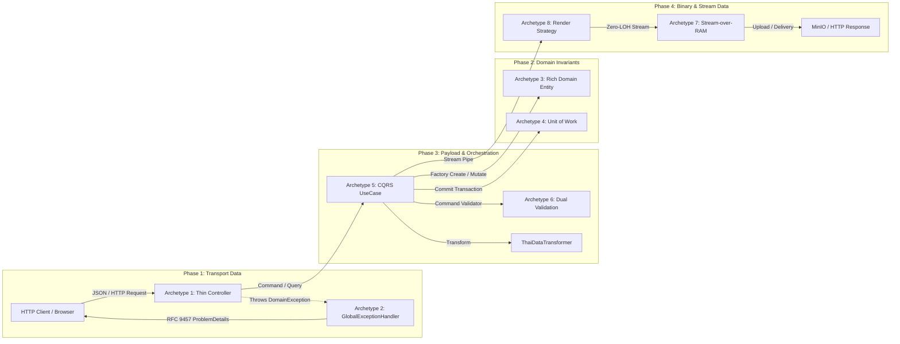

# PATTERNS.md — Canonical Architectural Patterns & Implementation Archetypes

> **Purpose:** This document is the authoritative Architectural Cookbook and Master Implementation Blueprint for the SMK Document Server (`backend-v2/` and `frontend-v2/`).
> **[AI_DIRECTIVE]:** AI Assistants (LLMs) and software engineers MUST treat these patterns as immutable golden archetypes. When creating new endpoints, use cases, domain entities, infrastructure services, or frontend components, you MUST mirror the structural anatomy, naming conventions, and data flows defined here. Never invent alternative architectural patterns.

<ai_directive>
CRITICAL ARCHITECTURAL ROUTING:
- **UNIVERSAL SCOPE DIRECTIVE:** All patterns, formulas, and archetypes in this document are **UNIVERSAL BLUEPRINTS** that apply across **ALL bounded contexts and domain entities** (including `Template`, `Project`, `Document`, `User`, `ApiKey`, and `AuditLog`). Never assume that an archetype or naming rule is exclusive to the specific entity shown in the example.
- For Syntax, Style, Formatting, and the 9 Craftsmanship Rules, refer to `docs/AI/CODING_CONVENTIONS.md`.
- For Prohibited Anti-Patterns and Common Pitfalls, refer to `docs/AI/ANTI-PATTERNS.md`.
</ai_directive>

---

## 📑 Table of Contents
1. **[Quick-Lookup: The Canonical Golden Archetypes](#1-⚡-quick-lookup-the-canonical-golden-archetypes)**
2. **[Part 1: Backend Lifecycle Archetypes (C# 13 / .NET 10)](#2-🔵-part-1-backend-lifecycle-archetypes-c-13--net-10)**
   - **Phase 1: Transport Boundary (HTTP Ingress & Error Egress)**
     - Archetype 1: Thin Controller & API Envelope Pattern
     - Archetype 2: RFC 9457 Global Exception Pipeline (`IExceptionHandler` SSoT)
   - **Phase 2: Domain Boundary (Core Business Invariants & Persistence)**
     - Archetype 3: Pure Rich Domain Entity & Value Object Pattern
     - Archetype 4: Atomic Unit of Work & Transaction Boundary
     - Specialized Utilities: High-Performance Smart Enums & UUIDv7 Entity Model
   - **Phase 3: Application & Payload Boundary (CQRS Orchestration)**
     - Archetype 5: Action-Centric CQRS UseCase Pattern
     - Archetype 6: Dual-Engine Validation Pipeline (Static Command + Dynamic Schema)
     - Centralized Localization: `ThaiDataTransformer` SSoT
   - **Phase 4: Binary & Stream Boundary (High-Throughput Rendering)**
     - Archetype 7: Zero-LOH Stream-over-RAM Direct Pipeline
     - Archetype 8: Polymorphic Render Strategy Engine
     - High-Throughput Caching: Compiled Handlebars AST Cache
     - Resilience & Observability: Polly v8 Pipeline & Native .NET 10 OpenTelemetry APM
3. **[Part 2: Frontend Lifecycle Archetypes (Next.js 15.2 / React 19)](#3-🟡-part-2-frontend-lifecycle-archetypes-nextjs-152--react-19)**
   - Archetype 9: Server-First RSC Data Fetching & Leaf Client Component
   - Archetype 10: Race-Condition-Free Live Preview (`AbortController` + Telemetry)
   - Archetype 11: Type-Safe RFC 9457 Client Diagnostic Adapter
4. **[Part 3: Cross-Document Integration](#4-🏛️-part-3-cross-document-integration)**

---

## 1. ⚡ Quick-Lookup: The Canonical Golden Archetypes

| Archetype | Lifecycle Phase | Architectural Location | Key Invariant / Standard |
|---|---|---|---|
| **Archetype 1: Thin Controller** | Phase 1 (Transport) | `SmkDoc.Api/Controllers/` | Receive request, delegate to UseCase, wrap in `ApiResponse<T>`, $\le 5$ lines |
| **Archetype 2: RFC 9457 Exception Handler** | Phase 1 (Transport) | `SmkDoc.Api/ExceptionHandlers/` | `IExceptionHandler` SSoT, maps Domain Exceptions to RFC 9457 ProblemDetails |
| **Archetype 3: Rich Domain Entity** | Phase 2 (Domain) | `SmkDoc.Domain/Entities/` | Pure POCO, `private set`, SSoT factory `Create()`, business verbs, UUIDv7 |
| **Archetype 4: Atomic Unit of Work** | Phase 2 (Domain) | `SmkDoc.Domain/Interfaces/` | `IUnitOfWork.CommitAsync(ct)` guarantees atomic multi-aggregate commits |
| **Archetype 5: Action-Centric UseCase** | Phase 3 (Payload) | `SmkDoc.Application/Modules/` | `sealed class`, C# 13 Primary Ctor, `IUseCase<TCommand, TResult>`, DTOs only |
| **Archetype 6: Dual-Engine Validation** | Phase 3 (Payload) | Application & Presentation | Static FluentValidation Filter + Cached dynamic `JsonSchema.Net` |
| **Archetype 7: Zero-LOH Stream-over-RAM** | Phase 4 (Binary) | Engines, Storage, Controllers | 100% Streaming from Gotenberg to MinIO/HTTP; zero multi-MB `byte[]` in RAM |
| **Archetype 8: Render Strategy Engine** | Phase 4 (Binary) | `SmkDoc.Infrastructure/Engines/` | `IEnumerable<IRenderEngine>` dispatch via Smart Enum; zero `switch`/`if-else` |
| **Archetype 9: Server-First RSC Data Flow**| Frontend | `frontend-v2/src/app/` | RSC async page fetcher, `notFound()` guard, leaf interactive client component |
| **Archetype 10: Live Preview Telemetry** | Frontend | `frontend-v2/src/hooks/` | In-flight `AbortController.abort()`, silent catch, round-trip latency metric badge |
| **Archetype 11: RFC 9457 Diagnostic Adapter**| Frontend | `frontend-v2/src/lib/api/` | Strongly-typed `ApiError` parser, error badge, field diagnostic drawer |

---

## 2. 🔵 Part 1: Backend Lifecycle Archetypes (C# 13 / .NET 10)



---

### Phase 1: Transport Boundary (HTTP Ingress & Error Egress)

#### Archetype 1: Thin Controller & API Envelope Pattern

*   **Intent & Scope:** Acts exclusively as the HTTP entry point. Validates routing, unpacks incoming HTTP request bodies, maps them to Application Commands or Queries, invokes the target UseCase, and wraps successful outputs in a standard response envelope (`ApiResponse<T>` or raw stream).
*   **Formula:** `public sealed class [Entity]Controller : ControllerBase` with actions delegating to `IUseCase<TCommand, TResult>`.
*   **Multi-Domain Concrete Examples:**
    1. *Authoring Context:* `TemplateController.Create` (returns `201 Created` with `CreatedAtAction`).
    2. *Execution Context:* `DocumentController.RenderStateless` (returns raw `FileStream` for binary PDF output).
    3. *Security Context:* `ApiKeyController.Revoke` (returns `204 NoContent`).

```csharp
// =========================================================================
// THE CANONICAL GOLDEN IMPLEMENTATION: Archetype 1
// =========================================================================
namespace SmkDoc.Api.Controllers;

using Microsoft.AspNetCore.Http;
using Microsoft.AspNetCore.Mvc;
using SmkDoc.Application.Common.Interfaces;
using SmkDoc.Application.Modules.Authoring.Commands.CreateTemplate;
using SmkDoc.Application.Modules.Authoring.DTOs;
using SmkDoc.Application.Modules.Authoring.Queries.GetTemplateById;
using SmkDoc.Api.Contracts.Common;
using SmkDoc.Api.Contracts.Templates;

[ApiController]
[Route("api/v1/templates")]
[Produces("application/json")]
public sealed class TemplateController(
    IUseCase<CreateTemplateCommand, TemplateResultDto> createTemplateUseCase,
    IUseCase<GetTemplateByIdQuery, TemplateResultDto> getTemplateByIdUseCase) : ControllerBase
{
    // 1. GET by ID: Standard 200 OK wrapped in ApiResponse<T>
    [HttpGet("{templateId:guid}")]
    [ProducesResponseType(typeof(ApiResponse<TemplateResultDto>), StatusCodes.Status200OK)]
    [ProducesResponseType(typeof(ProblemDetails), StatusCodes.Status404NotFound)]
    public async Task<ActionResult<ApiResponse<TemplateResultDto>>> GetById(
        [FromRoute] Guid templateId, 
        CancellationToken ct)
    {
        var query = new GetTemplateByIdQuery(templateId);
        var result = await getTemplateByIdUseCase.ExecuteAsync(query, ct);
        
        return Ok(new ApiResponse<TemplateResultDto>(result));
    }

    // 2. POST Creation: Explicit 201 Created with CreatedAtAction
    [HttpPost]
    [ProducesResponseType(typeof(ApiResponse<TemplateResultDto>), StatusCodes.Status201Created)]
    [ProducesResponseType(typeof(ProblemDetails), StatusCodes.Status400BadRequest)]
    [ProducesResponseType(typeof(ProblemDetails), StatusCodes.Status409Conflict)]
    public async Task<ActionResult<ApiResponse<TemplateResultDto>>> Create(
        [FromBody] CreateTemplateRequest request, 
        CancellationToken ct)
    {
        var command = new CreateTemplateCommand(request.ProjectId, request.Name, request.Slug, request.Category);
        var result = await createTemplateUseCase.ExecuteAsync(command, ct);
        
        return CreatedAtAction(
            nameof(GetById), 
            new { templateId = result.Id }, 
            new ApiResponse<TemplateResultDto>(result));
    }
}

// 3. Binary Stream Delivery Example (DocumentController.cs): Raw file stream bypasses envelope
[ApiController]
[Route("api/v1/documents")]
public sealed class DocumentController(
    IUseCase<RenderDocumentCommand, DocumentStreamResult> renderDocumentUseCase) : ControllerBase
{
    [HttpPost("render")]
    [Produces("application/pdf")]
    [ProducesResponseType(typeof(FileStreamResult), StatusCodes.Status200OK)]
    public async Task<IActionResult> Render([FromBody] RenderDocumentRequest request, CancellationToken ct)
    {
        var command = new RenderDocumentCommand(request.TemplateId, request.PayloadJson);
        var result = await renderDocumentUseCase.ExecuteAsync(command, ct);

        Response.Headers.ContentDisposition = "inline; filename=\"document.pdf\"";
        return File(result.Stream, "application/pdf");
    }
}
```

*   **Architectural Invariants & Hard Rules:**
    1. **$\le 5$ Lines Rule:** Controller action bodies must never exceed 5 lines of executable logic.
    2. **Zero Direct Persistence/Business Logic:** NEVER inject `IRepository`, `DbContext`, or business services into a Controller. Controllers interact exclusively with UseCases (`IUseCase<TCommand, TResult>`).
    3. **No Domain Entity Leaks:** NEVER accept a Domain Entity as a parameter and NEVER return a Domain Entity from a Controller action.
    4. **Envelope Invariant:** All JSON responses MUST be wrapped in `ApiResponse<T>` or `PagedApiResponse<T>`. Binary streams (PDF, DOCX, XLSX) MUST be returned directly via `File(...)` without an envelope.

---

#### Archetype 2: RFC 9457 Global Exception Pipeline (`IExceptionHandler` SSoT)

*   **Intent & Scope:** Intercepts all unhandled exceptions across the entire ASP.NET Core HTTP pipeline (including Middlewares, Routing, Filters, and UseCases) and maps them into strongly-typed RFC 9457 `ProblemDetails` responses. This guarantees that API consumers never receive raw 500 stack traces or non-standard error envelopes.
*   **Data Flow:**
    ```text
    Middleware / UseCase / Domain
            │ (Throws DomainException / NotFoundException / ConflictException)
            ▼
    [ app.UseExceptionHandler() ]
            │ (Catches unhandled exception in HTTP pipeline)
            ▼
    [ GlobalExceptionHandler : IExceptionHandler ]
            │ 1. Resolves (Status, Title, ErrorCode) via Pattern Matching
            │ 2. Emits Semantic Structured Log (logger.LogWarning / logger.LogError)
            │ 3. Assembles RFC 9457 ProblemDetails with extensions["errorCode"]
            ▼
    [ IProblemDetailsService.TryWriteAsync(...) ]
            │
            ▼
    Client receives HTTP 4xx/5xx conforming to RFC 9457 (application/problem+json)
    ```

```csharp
// =========================================================================
// THE CANONICAL GOLDEN IMPLEMENTATION: Archetype 2
// =========================================================================
namespace SmkDoc.Api.ExceptionHandlers;

using Microsoft.AspNetCore.Diagnostics;
using Microsoft.AspNetCore.Http;
using Microsoft.AspNetCore.Mvc;
using Microsoft.Extensions.Logging;
using SmkDoc.Application.Common.Exceptions;
using SmkDoc.Domain.Exceptions;

public sealed class GlobalExceptionHandler(
    ILogger<GlobalExceptionHandler> logger,
    IProblemDetailsService problemDetailsService) : IExceptionHandler
{
    public async ValueTask<bool> TryHandleAsync(
        HttpContext httpContext,
        Exception exception,
        CancellationToken ct)
    {
        var (status, title, errorCode) = ResolveExceptionDetails(exception);

        // 1. Semantic Structured Logging (Zero string interpolation in log template)
        if (status >= StatusCodes.Status500InternalServerError)
        {
            logger.LogError(exception, "Unhandled 5xx Server Error: {Message}", exception.Message);
        }
        else
        {
            logger.LogWarning("Handled 4xx Client/Domain Error [{ErrorCode}]: {Message}", errorCode, exception.Message);
        }

        // 2. Build RFC 9457 ProblemDetails instance
        var problemDetails = new ProblemDetails
        {
            Status = status,
            Title = title,
            Type = $"https://api.sammakorn.co.th/errors/{errorCode.ToLowerInvariant().Replace('_', '-')}",
            Instance = httpContext.Request.Path,
            Detail = status == StatusCodes.Status500InternalServerError && exception is not DomainException
                ? "An unexpected internal server error occurred."
                : exception.Message
        };

        problemDetails.Extensions["errorCode"] = errorCode;

        // 3. Attach rich validation errors if available
        if (exception is SchemaValidationException schemaEx)
        {
            problemDetails.Extensions["errors"] = schemaEx.Errors.Select(e => new
            {
                path = e.Field,
                message = e.Message,
                rule = e.Rule
            }).ToArray();
        }
        else if (exception is ValidationException validationEx)
        {
            problemDetails.Extensions["errors"] = validationEx.Errors;
        }

        // 4. Stream response via ASP.NET Core IProblemDetailsService
        httpContext.Response.StatusCode = status;
        return await problemDetailsService.TryWriteAsync(new ProblemDetailsContext
        {
            HttpContext = httpContext,
            ProblemDetails = problemDetails,
            Exception = exception
        });
    }

    private static (int Status, string Title, string ErrorCode) ResolveExceptionDetails(Exception exception) =>
        exception switch
        {
            NotFoundException notFound           => (StatusCodes.Status404NotFound, "Not Found", notFound.ErrorCode),
            DraftExpiredException draftExpired   => (StatusCodes.Status410Gone, "Draft Expired", draftExpired.ErrorCode),
            ConflictException conflict           => (StatusCodes.Status409Conflict, "Conflict", conflict.ErrorCode),
            RenderException render               => (StatusCodes.Status500InternalServerError, "Render Failed", render.ErrorCode),
            UnauthorizedException unauthorized   => (StatusCodes.Status401Unauthorized, "Unauthorized", unauthorized.ErrorCode),
            DomainValidationException domainVal  => (StatusCodes.Status400BadRequest, "Domain Validation Error", domainVal.ErrorCode),
            BusinessRuleViolationException rule  => (StatusCodes.Status400BadRequest, "Business Rule Violation", rule.ErrorCode),
            SchemaValidationException schema     => (StatusCodes.Status400BadRequest, "Schema Validation Failed", schema.ErrorCode),
            ValidationException validation       => (StatusCodes.Status400BadRequest, "Validation Failed", validation.ErrorCode),
            DomainException domain               => (StatusCodes.Status400BadRequest, "Domain Error", domain.ErrorCode),
            UnauthorizedAccessException          => (StatusCodes.Status401Unauthorized, "Unauthorized", "UNAUTHORIZED"),
            ArgumentException                    => (StatusCodes.Status400BadRequest, "Bad Request", "BAD_REQUEST"),
            InvalidOperationException            => (StatusCodes.Status409Conflict, "Conflict", "INVALID_OPERATION"),
            _                                    => (StatusCodes.Status500InternalServerError, "Internal Server Error", "INTERNAL_SERVER_ERROR")
        };
}
```

*   **Architectural Invariants & Hard Rules:**
    1. **Zero `try-catch` in Controllers:** NEVER wrap Controller actions in `try-catch` blocks. Throw strongly-typed Domain Exceptions from UseCases and let `GlobalExceptionHandler` handle mapping.
    2. **Single Source of Truth:** `GlobalExceptionHandler` is the SOLE authority for HTTP error response generation. Never build ad-hoc error responses in custom middlewares or filters.
    3. **RFC 9457 Strict Compliance:** All error bodies MUST be formatted as RFC 9457 `ProblemDetails` (`application/problem+json`). Anonymous error objects (e.g., `return BadRequest(new { error = "invalid" })`) are STRICTLY BANNED.

---

### Phase 2: Domain Boundary (Core Business Invariants & Persistence)

#### Archetype 3: Pure Rich Domain Entity & Value Object Pattern

*   **Intent & Scope:** Houses the core business rules and enterprise data invariants. Domain Entities are Plain Old CLR Objects (POCOs) completely isolated from frameworks, databases, and serialization concerns.
*   **Formula:** `public sealed class [Entity] : BaseEntity` with canonical factory `public static [Entity] Create(...)`, `internal` constructor for test fixtures, and domain mutation verbs.
*   **Multi-Domain Concrete Examples:**
    1. *Authoring Context:* `Template` entity with child `TemplateVersion` aggregate ownership.
    2. *Execution Context:* `DocumentLog` tracking generation status mutations (`MarkSucceeded`, `MarkFailed`).
    3. *Security Context:* `ApiKey` with credential hashing and lifecycle verbs (`Revoke`, `UpdateRateLimit`).

```csharp
// =========================================================================
// THE CANONICAL GOLDEN IMPLEMENTATION: Archetype 3
// =========================================================================
namespace SmkDoc.Domain.Entities;

using SmkDoc.Domain.Common;
using SmkDoc.Domain.Exceptions;
using SmkDoc.Domain.ValueObjects;

public sealed class Template : BaseEntity, IMustHaveProject
{
    private readonly List<TemplateVersion> versions = [];

    // Properties: Encapsulated with private setters
    public Guid ProjectId { get; private set; }
    public TemplateName Name { get; private set; } = null!;
    public TemplateSlug Slug { get; private set; } = null!;
    public string? Category { get; private set; }
    public bool IsActive { get; private set; }
    public Guid? CurrentVersionId { get; private set; }
    public IReadOnlyCollection<TemplateVersion> Versions => versions.AsReadOnly();

    // 1. Parameterless private constructor exclusively for EF Core materialization
    private Template() { }

    // 2. Internal constructor accessible to Test Fixtures via InternalsVisibleTo
    internal Template(
        Guid? id, 
        Guid projectId, 
        TemplateName name, 
        TemplateSlug slug, 
        string? category, 
        DateTimeOffset now) : base(id, createdAt: now)
    {
        ProjectId = Guard.NotEmpty(projectId, nameof(ProjectId));
        Name = Guard.NotNull(name, nameof(Name));
        Slug = Guard.NotNull(slug, nameof(Slug));
        Category = string.IsNullOrWhiteSpace(category) ? null : category.Trim();
        IsActive = true;
    }

    // 3. Single Canonical Factory Method (SSoT for creation)
    public static Template Create(
        Guid projectId, 
        TemplateName name, 
        TemplateSlug slug, 
        string? category, 
        DateTimeOffset now) =>
        new(null, projectId, name, slug, category, now);

    // 4. Expressive Domain Verbs (Encapsulated State Mutations)
    public void SetCurrentVersion(Guid versionId, DateTimeOffset now)
    {
        Guard.NotEmpty(versionId, nameof(versionId));

        if (!IsActive)
        {
            throw new BusinessRuleViolationException("Cannot assign a version to an inactive template.", "INACTIVE_TEMPLATE");
        }

        if (versions.Count > 0 && !versions.Any(v => v.Id == versionId))
        {
            throw new VersionNotInTemplateException(Id, versionId);
        }

        CurrentVersionId = versionId;
        SetUpdated(now);
    }

    public void Deactivate(DateTimeOffset now)
    {
        if (!IsActive) return; // Idempotent exit
        
        IsActive = false;
        SetUpdated(now);
    }
}

// Canonical Value Object Archetype: Self-validating, immutable record
public sealed partial record TemplateSlug
{
    public string Value { get; }

    public TemplateSlug(string value)
    {
        if (string.IsNullOrWhiteSpace(value))
        {
            throw new DomainValidationException("Slug cannot be empty.");
        }

        var normalized = value.Trim().ToLowerInvariant();
        if (!SlugRegex().IsMatch(normalized))
        {
            throw new DomainValidationException($"Slug '{value}' is invalid. Must be lowercase alphanumeric with hyphens.");
        }

        Value = normalized;
    }

    public static TemplateSlug Create(string value) => new(value);

    [GeneratedRegex("^[a-z0-9]+(?:-[a-z0-9]+)*$")]
    private static partial Regex SlugRegex();
}
```

*   **Architectural Invariants & Hard Rules:**
    1. **Persistence Ignorance:** NEVER reference EF Core, Npgsql, or NuGet packages inside `SmkDoc.Domain`.
    2. **No Public Property Setters:** Properties MUST have `private set;`. Direct external mutation (e.g., `template.IsActive = false;`) is STRICTLY PROHIBITED.
    3. **Canonical Factory SSoT:** Entity creation MUST pass through the canonical `Create()` factory method. Never expose public parameterized constructors.
    4. **No Records for Entities:** Entities MUST be declared as `public sealed class`. NEVER declare Domain Entities as `record` types (EF Core Change Tracker requires reference identity).

---

#### Archetype 4: Atomic Unit of Work & Transaction Boundary

*   **Intent & Scope:** Coordinates operations across multiple domain repositories to ensure that state mutations are committed atomically within a single PostgreSQL database transaction.
*   **Formula:** Repositories mutate in-memory state; `IUnitOfWork.CommitAsync(ct)` finalizes the database transaction.

```csharp
// =========================================================================
// THE CANONICAL GOLDEN IMPLEMENTATION: Archetype 4
// =========================================================================
namespace SmkDoc.Domain.Interfaces;

public interface IUnitOfWork
{
    Task<int> CommitAsync(CancellationToken ct = default);
}

// Canonical Usage Pattern across Multi-Aggregate Operations:
public async Task<TemplateResultDto> ExecuteAsync(CreateTemplateWithVersionCommand command, CancellationToken ct)
{
    var now = timeProvider.GetUtcNow();
    var template = Template.Create(command.ProjectId, TemplateName.Create(command.Name), TemplateSlug.Create(command.Slug), null, now);
    var version = TemplateVersion.Create(template.Id, 1, command.HtmlContent, now);

    // Enqueue mutations across distinct repositories
    await templateRepository.AddAsync(template, ct);
    await versionRepository.AddAsync(version, ct);

    // Atomic commit: Either both entities persist, or neither persists
    await unitOfWork.CommitAsync(ct);

    return new TemplateResultDto(template.Id, template.Name.Value, template.CreatedAt);
}
```

*   **Architectural Invariants & Hard Rules:**
    1. **Atomic Boundaries:** Repositories MUST NOT call `SaveChangesAsync()` internally. Persistence is strictly finalized via `IUnitOfWork.CommitAsync(ct)`.
    2. **Tenant Scoping:** Repository methods MUST require tenant/project keys for data partition isolation (e.g., `GetBySlugAsync(Guid projectId, TemplateSlug slug, CancellationToken ct)`).

---

### Phase 3: Application & Payload Boundary (CQRS Orchestration)

#### Archetype 5: Action-Centric CQRS UseCase Pattern

*   **Intent & Scope:** Orchestrates business operations by loading aggregates via repositories, executing domain mutations, saving changes via the Unit of Work, and returning strictly mapped Application DTOs.
*   **Formula:** `public sealed class [Action][Entity]UseCase(...) : IUseCase<[Action][Entity]Command, [Context]ResultDto>`.
*   **Multi-Domain Concrete Examples:**
    1. *Authoring Context:* `CreateTemplateUseCase`.
    2. *Execution Context:* `GenerateDocumentUseCase`.
    3. *Security Context:* `RevokeApiKeyUseCase`.

```csharp
// =========================================================================
// THE CANONICAL GOLDEN IMPLEMENTATION: Archetype 5
// =========================================================================
namespace SmkDoc.Application.Modules.Authoring.Commands.CreateTemplate;

using SmkDoc.Application.Common.Exceptions;
using SmkDoc.Application.Common.Interfaces;
using SmkDoc.Application.Modules.Authoring.DTOs;
using SmkDoc.Domain.Entities;
using SmkDoc.Domain.Interfaces;
using SmkDoc.Domain.ValueObjects;

public sealed class CreateTemplateUseCase(
    ITemplateRepository templateRepo,
    IProjectRepository projectRepo,
    IUnitOfWork unitOfWork,
    TimeProvider timeProvider) : IUseCase<CreateTemplateCommand, TemplateResultDto>
{
    public async Task<TemplateResultDto> ExecuteAsync(CreateTemplateCommand command, CancellationToken ct)
    {
        // 1. Guard Clauses & Precondition Validation
        var project = await projectRepo.GetByIdAsync(command.ProjectId, ct);
        if (project is null)
        {
            throw new NotFoundException($"Project '{command.ProjectId}' does not exist.");
        }

        var slug = TemplateSlug.Create(command.Slug);
        if (await templateRepo.ExistsBySlugAsync(command.ProjectId, slug, ct))
        {
            throw new ConflictException($"Template with slug '{command.Slug}' already exists in this project.");
        }

        // 2. Domain Entity Creation via Canonical Factory
        var now = timeProvider.GetUtcNow();
        var templateName = TemplateName.Create(command.Name);
        var template = Template.Create(command.ProjectId, templateName, slug, command.Category, now);

        // 3. Persistence via Repository & UnitOfWork
        await templateRepo.AddAsync(template, ct);
        await unitOfWork.CommitAsync(ct);

        // 4. Return Immutable Result DTO
        return new TemplateResultDto(template.Id, template.Name.Value, template.CreatedAt);
    }
}
```

*   **Architectural Invariants & Hard Rules:**
    1. **Primary Constructor Invariant:** Must use C# 13 Primary Constructor with pure `camelCase` parameters. Re-declaring `private readonly` fields is STRICTLY FORBIDDEN.
    2. **Deterministic Time Injection:** NEVER call `DateTime.UtcNow`. Always obtain timestamps via `timeProvider.GetUtcNow()`.
    3. **DTO Output Barrier:** NEVER return Domain Entities from a UseCase. All outputs must be immutable positional records (`*ResultDto`).

---

#### Archetype 6: Dual-Engine Validation Pipeline (Static Command + Dynamic Schema)

*   **Intent & Scope:** Implements a two-tier fail-fast validation architecture:
    1. **Tier 1 (Static Input Format):** Validates incoming C# Commands at the HTTP edge using `FluentValidation` before reaching the UseCase.
    2. **Tier 2 (Dynamic Document Payload):** Validates arbitrary JSON data payloads against the template's JSON Schema (Draft-07) using cached `JsonSchema.Net` in Application/Infrastructure.
*   **Data Flow:**
    ```text
    HTTP Request 
         │
         ▼
    [ ValidateCommandFilter ] ──(FluentValidation)──► Fails? ──► Throws ValidationException (HTTP 400)
         │ (Passes)
         ▼
    [ UseCase.ExecuteAsync ]
         │
         ▼
    [ IJsonSchemaValidationService ] ──(Draft-07)──► Fails? ──► Throws SchemaValidationException (HTTP 400)
         │ (Passes)
         ▼
    [ Render Engine Pipeline ]
    ```

```csharp
// =========================================================================
// THE CANONICAL GOLDEN IMPLEMENTATION: Archetype 6
// =========================================================================

// 1. Tier 1 Static Command Validator (Colocated with Command in Application)
public sealed class CreateTemplateCommandValidator : AbstractValidator<CreateTemplateCommand>
{
    public CreateTemplateCommandValidator()
    {
        RuleFor(x => x.ProjectId).NotEmpty();
        RuleFor(x => x.Name).NotEmpty().Length(2, 100);
        RuleFor(x => x.Slug).NotEmpty().Matches(@"^[a-z0-9]+(?:-[a-z0-9]+)*$");
    }
}

// 2. Tier 2 Dynamic JSON Schema Validation within Document Execution
public async Task<DocumentResultDto> ExecuteAsync(GenerateDocumentCommand command, CancellationToken ct)
{
    var template = await templateRepo.GetByIdAsync(command.TemplateId, ct)
        ?? throw new NotFoundException($"Template '{command.TemplateId}' not found.");

    // Dynamic Payload Validation via In-Memory Cached JsonSchema.Net
    if (!command.SkipValidation)
    {
        var validationResult = await schemaValidationService.ValidatePayloadAsync(
            template.CurrentVersion.SchemaJson, 
            command.PayloadJson, 
            ct);

        if (!validationResult.IsValid)
        {
            throw new SchemaValidationException(template.Slug.Value, validationResult.Errors);
        }
    }

    // Proceed to rendering pipeline...
    return ...;
}
```

*   **Architectural Invariants & Hard Rules:**
    1. **No Rule Duplication (DRY):** Input format and syntax checks belong exclusively to `FluentValidation`. Business domain rules belong exclusively inside Domain Entities. Never validate the same constraint in both tiers.
    2. **Schema Compilation Caching:** `JsonSchemaValidationService` MUST cache compiled `JsonSchema` instances in memory (via `ConcurrentDictionary`) to eliminate redundant JSON AST parsing during high-throughput workloads.

---

### Phase 4: Binary & Stream Boundary (High-Throughput Rendering)

#### Archetype 7: Zero-LOH Stream-over-RAM Direct Pipeline

*   **Intent & Scope:** Ingests HTML or Office templates, renders them through Gotenberg (Chromium/LibreOffice), and streams output PDFs directly to MinIO or HTTP responses without buffering multi-megabyte `byte[]` arrays into RAM. Prevents Large Object Heap (LOH) fragmentation and Out-of-Memory (OOM) crashes under high concurrency.
*   **Data Flow:**
    ```text
    [ MinIO Storage ] ──(DownloadStream)──► [ Handlebars Compiler / Template Engine ]
                                                          │
                                                    (RenderStream)
                                                          ▼
                                            [ Gotenberg HTTP Client ]
                                                          │ (HttpResponseMessage.Content.ReadAsStreamAsync)
                                                          ▼
                                            [ Direct Network Stream ]
                                             │                     │
                                (Stateless Preview)         (Persisted Production)
                                             ▼                     ▼
                                  HTTP Response (File)       MinIO UploadStream
    ```

```csharp
// =========================================================================
// THE CANONICAL GOLDEN IMPLEMENTATION: Archetype 7
// =========================================================================
public sealed class GenerateDocumentUseCase(
    ITemplateRepository templateRepo,
    IStorageService storageService,
    IRenderEngine renderEngine,
    TimeProvider timeProvider) : IUseCase<GenerateDocumentCommand, DocumentResultDto>
{
    public async Task<DocumentResultDto> ExecuteAsync(GenerateDocumentCommand command, CancellationToken ct)
    {
        var template = await templateRepo.GetByIdAsync(command.TemplateId, ct)
            ?? throw new NotFoundException($"Template '{command.TemplateId}' not found.");

        // 1. Stream template source from storage (Zero LOH memory allocation)
        await using var templateStream = await storageService.DownloadAsync(
            StorageBuckets.Templates, 
            template.CurrentVersion.StorageKey, 
            ct);

        // 2. Render through engine directly returning a readable Network Stream
        await using var outputPdfStream = await renderEngine.RenderStreamAsync(
            templateStream, 
            command.PayloadJson, 
            OutputFormat.Pdf, 
            ct);

        // 3. Pipe output stream directly into MinIO S3 upload without byte[] buffering
        var outputKey = $"outputs/{Guid.CreateVersion7()}.pdf";
        await storageService.UploadAsync(
            StorageBuckets.Outputs, 
            outputKey, 
            outputPdfStream, 
            "application/pdf", 
            ct);

        return new DocumentResultDto(outputKey, OutputFormat.Pdf.Extension);
    }
}
```

*   **Architectural Invariants & Hard Rules:**
    1. **Zero `byte[]` Buffering:** NEVER call `MemoryStream.ToArray()` or allocate `byte[]` arrays for generated documents. All transformations and network transfers MUST operate over raw `Stream` instances.
    2. **Stateless Preview Isolation:** Preview endpoints (`PreviewDocumentUseCase`) MUST remain 100% in-memory and stream directly to the HTTP response. NEVER persist preview artifacts to PostgreSQL or MinIO.

---

#### Archetype 8: Polymorphic Render Strategy Engine

*   **Intent & Scope:** Provides an extensible rendering pipeline (Open/Closed Principle) that dynamically selects the correct document renderer (HTML/Chromium, DOCX/OpenXml, XLSX/ClosedXML) at runtime without using hardcoded `switch` or `if/else` statements.
*   **Formula:** Inject `IEnumerable<IRenderEngine>` into Application UseCases and resolve via `engines.FirstOrDefault(e => e.EngineType == requestedType)`.

```csharp
// =========================================================================
// THE CANONICAL GOLDEN IMPLEMENTATION: Archetype 8
// =========================================================================
namespace SmkDoc.Infrastructure.Engines;

using SmkDoc.Domain.Enums;

public interface IRenderEngine
{
    RenderEngineType EngineType { get; }
    Task<Stream> RenderStreamAsync(Stream templateStream, string payloadJson, OutputFormat outputFormat, CancellationToken ct);
}

// Canonical Strategy Resolution in Application Layer:
public sealed class RenderDocumentUseCase(
    IEnumerable<IRenderEngine> renderEngines) : IUseCase<RenderDocumentCommand, DocumentStreamResult>
{
    public async Task<DocumentStreamResult> ExecuteAsync(RenderDocumentCommand command, CancellationToken ct)
    {
        // Polymorphic strategy selection: Zero hardcoded switch or if-else ladders
        var targetEngine = renderEngines.FirstOrDefault(engine => engine.EngineType == command.EngineType)
            ?? throw new InvalidOperationException($"No render engine is registered for '{command.EngineType}'.");

        var stream = await targetEngine.RenderStreamAsync(command.TemplateStream, command.PayloadJson, command.OutputFormat, ct);
        return new DocumentStreamResult(stream, command.OutputFormat.MimeType);
    }
}
```

*   **Architectural Invariants & Hard Rules:**
    1. **No `switch` on Engine Types:** NEVER write `switch (engineType)` or `if (type == "html")` to instantiate engines. New engines MUST be added simply by implementing `IRenderEngine` and registering in Dependency Injection.

---

## 3. 🟡 Part 2: Frontend Lifecycle Archetypes (Next.js 15.2 / React 19)

---

### Archetype 9: Server-First RSC Data Fetching & Leaf Client Component

*   **Intent & Scope:** Enforces Next.js 15 App Router architecture. Pages execute securely on the server as React Server Components (RSC) to fetch initial data directly, stream HTML for maximum SEO and performance, and isolate interactive JavaScript to leaf components via `"use client"`.

```tsx
// =========================================================================
// THE CANONICAL GOLDEN IMPLEMENTATION: Archetype 9
// File: src/app/templates/[templateId]/page.tsx (React Server Component)
// =========================================================================
import { notFound } from "next/navigation";
import { fetchTemplateById } from "@/lib/api/templates";
import { TemplateEditorClient } from "@/components/features/templates/TemplateEditorClient";

interface TemplatePageProps {
  params: Promise<{ templateId: string }>;
}

// 1. Server Component by default: Direct async data fetching on the server
export default async function TemplatePage({ params }: TemplatePageProps) {
  const { templateId } = await params;
  const template = await fetchTemplateById(templateId);

  // 2. Early Guard Clause: Standard Next.js notFound handler
  if (!template) {
    notFound();
  }

  // 3. Isolated interactive client component at the leaf
  return (
    <main className="container mx-auto px-4 py-6">
      <div className="mb-6 flex items-center justify-between">
        <h1 className="text-2xl font-bold tracking-tight text-neutral-900">{template.name}</h1>
      </div>
      <TemplateEditorClient initialTemplate={template} />
    </main>
  );
}
```

*   **Architectural Invariants & Hard Rules:**
    1. **Server by Default:** `page.tsx` and `layout.tsx` MUST NEVER include `"use client"`.
    2. **Zero `useEffect` Data Fetching:** NEVER use `useEffect` to fetch initial page data. Fetch data in the Server Component and pass it down as props.

---

### Archetype 10: Race-Condition-Free Live Preview (`AbortController` + Telemetry)

*   **Intent & Scope:** Ensures that rapid typing in the Monaco Editor or form fields does not spawn overlapping HTTP requests that resolve out of order. Automatically aborts stale in-flight requests and measures round-trip rendering latency.

```tsx
// =========================================================================
// THE CANONICAL GOLDEN IMPLEMENTATION: Archetype 10
// File: src/hooks/useLivePreview.ts
// =========================================================================
"use client";

import { useRef, useState, useCallback } from "react";
import { renderPreviewApi } from "@/lib/api/documents";

export function useLivePreview() {
  const abortControllerRef = useRef<AbortController | null>(null);
  const [previewBlobUrl, setPreviewBlobUrl] = useState<string | null>(null);
  const [latencyMs, setLatencyMs] = useState<number | null>(null);
  const [isRendering, setIsRendering] = useState(false);

  const triggerPreview = useCallback(async (templateId: string, payload: Record<string, unknown>) => {
    // 1. Abort any previous pending preview request immediately
    if (abortControllerRef.current) {
      abortControllerRef.current.abort();
    }

    const abortController = new AbortController();
    abortControllerRef.current = abortController;

    setIsRendering(true);
    const startTime = performance.now();

    try {
      const blob = await renderPreviewApi(templateId, payload, abortController.signal);
      
      const endTime = performance.now();
      setLatencyMs(Math.round(endTime - startTime));
      
      // Revoke previous URL to prevent client memory leaks
      if (previewBlobUrl) {
        URL.revokeObjectURL(previewBlobUrl);
      }
      
      setPreviewBlobUrl(URL.createObjectURL(blob));
    } catch (error: unknown) {
      // 2. Silently ignore intentional abort exceptions
      if (error instanceof DOMException && error.name === "AbortError") {
        return;
      }
      console.error("Live preview generation failed:", error);
    } finally {
      setIsRendering(false);
    }
  }, [previewBlobUrl]);

  return { previewBlobUrl, latencyMs, isRendering, triggerPreview };
}
```

---

### Archetype 11: Type-Safe RFC 9457 Client Diagnostic Adapter

*   **Intent & Scope:** Intercepts HTTP error responses from the backend, detects RFC 9457 `application/problem+json` payloads, and unpacks them into strongly-typed `ApiError` instances for visual display in error banners and diagnostic field drawers.

```typescript
// =========================================================================
// THE CANONICAL GOLDEN IMPLEMENTATION: Archetype 11
// File: src/lib/api/client.ts
// =========================================================================
export interface ProblemDetailsError {
  type?: string;
  title?: string;
  status: number;
  detail?: string;
  instance?: string;
  errorCode?: string;
  errors?: Array<{ path: string; message: string; rule?: string }>;
}

export class ApiError extends Error {
  constructor(
    public readonly status: number,
    public readonly problemDetails: ProblemDetailsError
  ) {
    super(problemDetails.detail ?? problemDetails.title ?? "An API error occurred");
    this.name = "ApiError";
  }
}

export async function parseResponse<T>(response: Response): Promise<T> {
  if (response.ok) {
    if (response.status === 204) return {} as T;
    return (await response.json()) as T;
  }

  const contentType = response.headers.get("content-type");
  if (contentType?.includes("application/problem+json") || contentType?.includes("application/json")) {
    const errorJson = (await response.json()) as ProblemDetailsError;
    throw new ApiError(response.status, errorJson);
  }

  throw new ApiError(response.status, {
    status: response.status,
    title: response.statusText,
    detail: await response.text()
  });
}
```

---

## 4. 🏛️ Part 3: Cross-Document Integration

To preserve the Single Source of Truth (SSoT) across the entire documentation suite, use this integration map:

```text
┌────────────────────────────────────────────────────────────────────────┐
│ AGENTS.md (Operating System & Governance Engine)                       │
│  - Mandates Clean Architecture and non-negotiable invariants.          │
│  - Enforces Context Triggers and Verification Protocols.               │
└───────────────────────────────────┬────────────────────────────────────┘
                                    │
         ┌──────────────────────────┴──────────────────────────┐
         ▼                                                     ▼
┌──────────────────────────────────┐  ┌──────────────────────────────────┐
│ docs/AI/CODING_CONVENTIONS.md    │  │ docs/AI/PATTERNS.md              │
│ (The Craftsmanship & Style Bible)│  │ (The Architectural Cookbook)     │
│  - The 9 Golden Craftsmanship    │  │  - The 11 Golden Archetypes      │
│    Rules (Stepdown, Proximity).  │  │  - Data Flow Lifecycles.         │
│  - Modern C# 13 / Next.js 15     │  │  - Zero-LOH Stream-over-RAM.     │
│    Language Idioms.              │  │  - Dual Validation Pipeline.     │
│  - Naming Matrix & Variable Dict │  │  - End-to-End Code Blueprints.   │
└──────────────────────────────────┘  └──────────────────────────────────┘
```
