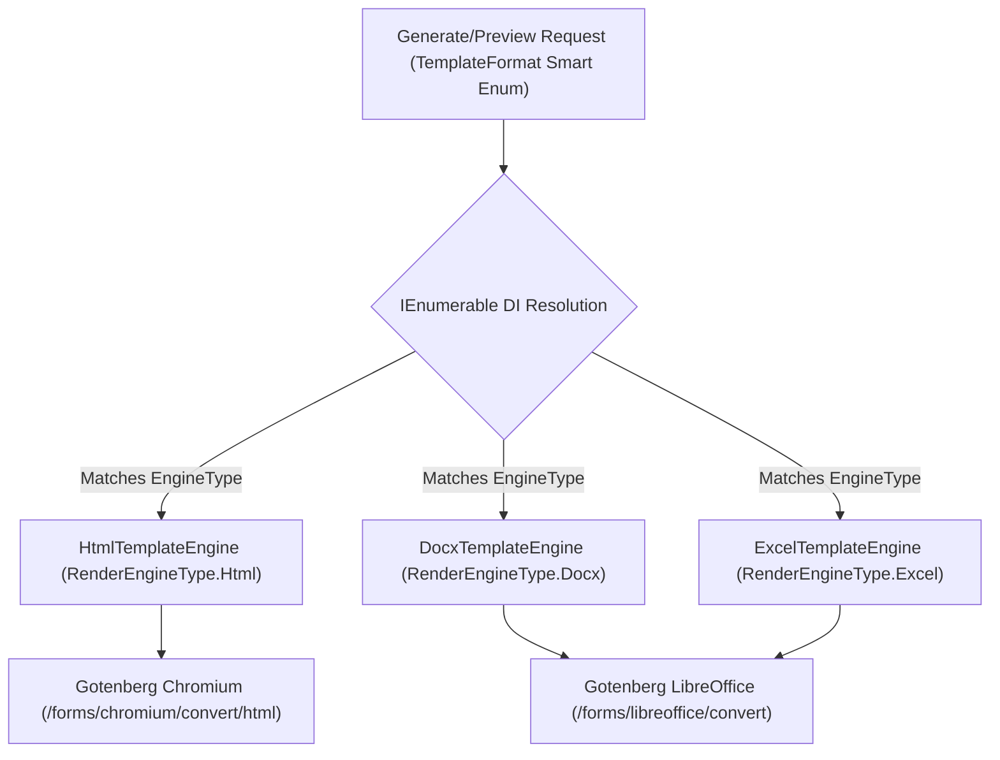
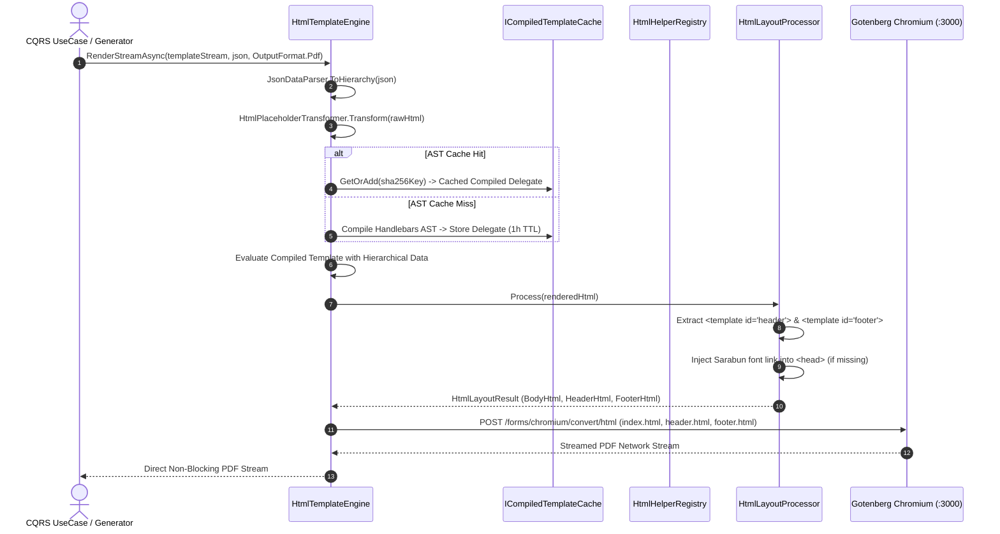
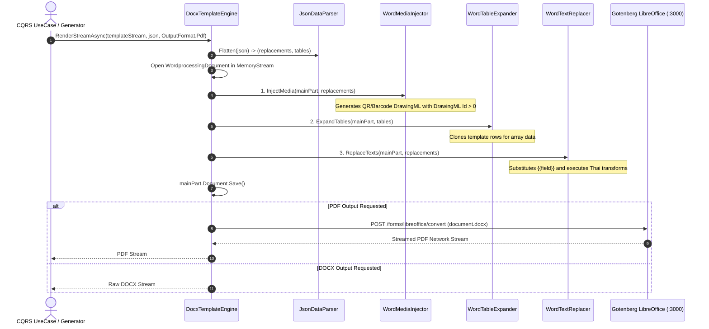
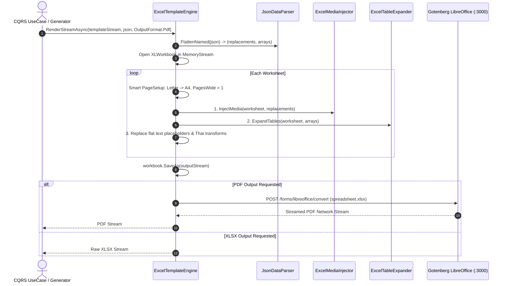
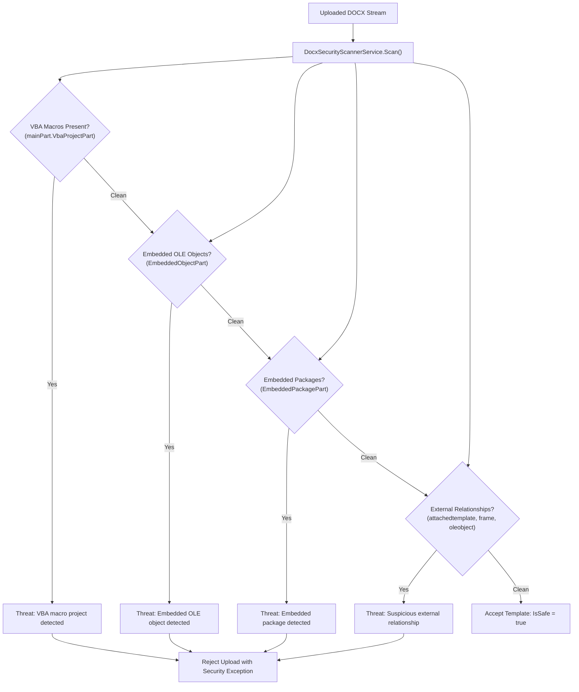

# TEMPLATE_ENGINE.md — Template Engines & Rendering Specifications

> **Purpose:** Authoritative rendering engine pipelines, Handlebars helpers, OpenXML/ClosedXML composable steps, Gotenberg Chromium/LibreOffice gateways, Thai typography, and document security scanning for `smk-doc-server`.  
> **Related Docs:** [ARCHITECTURE.md](ARCHITECTURE.md) (Gotenberg resilience & Zero-LOH streaming), [PATTERNS.md](PATTERNS.md) (Polymorphic strategy dispatch), [CODING_CONVENTIONS.md](CODING_CONVENTIONS.md) (Craftsmanship standards), [ANTI-PATTERNS.md](ANTI-PATTERNS.md) (Rendering pitfalls), [DB_SCHEMA.md](DB_SCHEMA.md) (Template storage schema).

<ai_directive>
CRITICAL ATTENTION ROUTING & RENDERING INVARIANTS:
1. **The Open-Closed Principle (OCP):** Rendering engine selection MUST use polymorphic strategy dispatch (`IEnumerable<IRenderEngine>`). Hardcoded `switch` or `if-else` branching on engine types is strictly prohibited.
2. **The Stream-over-RAM Paradigm:** Engines MUST support `RenderStreamAsync` to stream Gotenberg HTTP response payloads directly to caller network sockets or MinIO uploads. Buffering multi-megabyte documents into Gen 2 Large Object Heap (`byte[]`) is strictly prohibited.
3. **SSoT Placeholder Parsing:** All placeholder matching and extraction MUST route through `PlaceholderHelper.Pattern` and `PlaceholderHelper.Parse()`. Inline ad-hoc regex expressions are prohibited.
4. **DrawingML Id Invariant (Word Desktop Crash Prevention):** In OpenXML image injection, `NonVisualDrawingProperties.Id` MUST ALWAYS be a positive non-zero integer (`(uint)counter + 1`). Generating `Id = 0` corrupts DOCX files in Microsoft Word Desktop.
5. **Deterministic Thai Typography:** HTML rendering MUST guarantee Thai font availability by automatically injecting the canonical Sarabun web font into `<head>` when missing.
</ai_directive>

<template_engine_scope>

### ⚡ Quick-Lookup: Rendering Engines & Capabilities Matrix

| Format | Engine Class | Syntax & Expression Style | Core Pipeline Processing Steps | Dynamic Media Support | Typography & Fonts | Output Deliverables | PDF Renderer |
|---|---|---|---|---|---|---|---|
| **HTML** | `HtmlTemplateEngine` | Handlebars.Net (`{{var}}`, `{{#each}}`, `{{#ifEquals}}`) | AST Cache → Handlebars Merge → Header/Footer Split → Sarabun Injection | QR Code (`{{qr}}`), Barcode (`{{barcode}}`) | Automatic Sarabun web font injection | Raw HTML, PDF | Gotenberg Chromium (`:3000/forms/chromium/convert/html`) |
| **DOCX** | `DocxTemplateEngine` | OpenXML placeholders (`{{field}}`, `{{field:transform}}`) | Media Injection → Dynamic Table Row Expansion → Text Replacement | Embedded PNG DrawingML (`{{qr:field}}`, `{{barcode:field}}`) | Embedded template styles & system fonts | Raw DOCX, PDF | Gotenberg LibreOffice (`:3000/forms/libreoffice/convert`) |
| **XLSX** | `ExcelTemplateEngine` | ClosedXML cell tags (`{{field}}`, `{{field:transform}}`) | Smart PageSetup (A4) → Media Injection → Table Expansion → Cell Text | Embedded worksheet pictures (`{{qr:field}}`, `{{barcode:field}}`) | Excel cell styles & font formatting | Raw XLSX, PDF | Gotenberg LibreOffice (`:3000/forms/libreoffice/convert`) |

---

## 1. 🌐 Polymorphic Engine Strategy & Architecture

The document server selects and invokes the appropriate rendering pipeline dynamically using the **Strategy Pattern**, adhering strictly to the Open-Closed Principle (OCP):



### 1.1 The Strategy Interface Contract
Every document rendering engine implements `IRenderEngine`:

```csharp
public interface IRenderEngine
{
    RenderEngineType EngineType { get; }

    Task<Stream> RenderStreamAsync(
        Stream templateStream,
        string inputDataJson,
        OutputFormat outputFormat,
        CancellationToken ct = default);

    Task<byte[]> RenderAsync(
        Stream templateStream,
        string inputDataJson,
        OutputFormat outputFormat,
        CancellationToken ct = default);
}
```

> **The OCP Invariant:** Introducing a new engine format (e.g., Markdown, Typst, or PPTX) requires creating a new `IRenderEngine` implementation and registering it in DI. The UseCase orchestration pipeline remains untouched.

---

## 2. 🌐 HTML & Chromium Headless Pipeline (`HtmlTemplateEngine`)

The HTML engine processes rich HTML templates with Handlebars.Net and converts them to pixel-perfect PDF documents via Gotenberg's headless Chromium runtime:



### 2.1 Authoritative Handlebars Helper Catalog

All Handlebars helpers are centrally registered via `HtmlHelperRegistry`:

| Helper Name | Syntax Example | Description & Output Behavior |
|---|---|---|
| `thaitransform` | `{{thaitransform amount "baht"}}` | Generic Thai data transformation router calling `ThaiDataTransformer.Transform`. |
| `thai_baht_text` | `{{thai_baht_text total}}` | Formats numeric/currency string into formal Thai Baht text (e.g., `สองล้านห้าแสนบาทถ้วน`). |
| `thai_date` | `{{thai_date issueDate}}` | Formats ISO-8601 date into full Thai Buddhist Era date (e.g., `10 ตุลาคม 2569`). |
| `format_number` | `{{format_number price}}` | Formats numeric value with commas and 2 decimal places (e.g., `2,500,000.00`). |
| `addOne` / `inc` | `{{addOne @index}}` | 1-based loop index counter for table numbering (converts `0` to `1`). |
| `ifEquals` | `{{#ifEquals status "active"}}...{{/ifEquals}}` | Block helper for case-insensitive string equality comparison with `{{else}}` support. |
| `qr` / `qrcode` | `{{qr invoiceNo}}` | Generates a 150×150px embedded QR Code as a self-contained Base64 Data URI `` tag. |
| `barcode` | `{{barcode sku}}` | Generates a 300×100px embedded 1D Barcode as a self-contained Base64 Data URI `` tag. |

### 2.2 Supported `ThaiDataTransformer` Formats via `thaitransform`
The `{{thaitransform value "type"}}` helper routes directly to `ThaiDataTransformer.Transform`, supporting the following canonical types:

*   `"baht"` / `"thai_baht_text"`: Thai Baht text (`หนึ่งร้อยบาทถ้วน`).
*   `"currency"` / `"number"`: Standard currency format with 2 decimal places (`1,250.00`).
*   `"currency0"`: Currency format without decimals (`1,250`).
*   `"date"` / `"thai_date"`: Full Thai Buddhist Era date (`10 ตุลาคม 2569`).
*   `"thaidate_short"`: Abbreviated Thai date (`10 ต.ค. 2569`).
*   `"thaidatetime"`: Thai date with timestamp (`10 ตุลาคม 2569 14:30 น.`).
*   `"phone"`: Formats 10-digit Thai phone numbers (`081-234-5678`).
*   `"idcard"`: Formats 13-digit Thai National ID card (`1-2345-67890-12-3`).
*   `"upper"`: Converts text to uppercase.
*   `"lower"`: Converts text to lowercase.

### 2.3 Layout Processor & Header/Footer Separation
`HtmlLayoutProcessor` scans the rendered HTML and separates Gotenberg Chromium header/footer fragments:

```html
<!-- Header template (Optional) -->
<template id="header">
  <div style="font-size: 8pt; width: 100%; display: flex; justify-content: space-between;">
    <span>{{companyName}}</span>
    <span>Report: {{reportTitle}}</span>
  </div>
</template>

<!-- Footer template with Chromium page numbering (Optional) -->
<template id="footer">
  <div style="font-size: 8pt; width: 100%; text-align: right;">
    <span>Page <span class="pageNumber"></span> of <span class="totalPages"></span></span>
  </div>
</template>

<!-- Main Document Body -->
<body>
  <h1>Invoice #{{invoiceNumber}}</h1>
  <!-- Document contents -->
</body>
```

### 2.4 Thai Typography & Web Font Injection
*   **The Invariant:** To prevent Thai character corruption and vowel misalignment ("สระลอย"), `HtmlLayoutProcessor` inspects the document `<head>`.
*   If Google Fonts or an existing `font-family` declaration is not detected, it automatically injects:
    ```html
    <link rel="stylesheet" href="https://fonts.googleapis.com/css2?family=Sarabun:wght@300;400;600;700&display=swap">
    <style>body { font-family: 'Sarabun', sans-serif; }</style>
    ```

### 2.5 Compiled AST Cache (`ICompiledTemplateCache`)
*   **CPU Optimization:** Parsing Handlebars Abstract Syntax Trees (AST) on every request wastes CPU cycles under high throughput.
*   **Implementation:** `MemoryCompiledTemplateCache` caches compiled execution delegates keyed by the deterministic SHA-256 hash of the normalized template HTML (`Convert.ToHexString(SHA256.HashData(...))`), achieving sub-millisecond AST rehydration and reducing rendering latency by 40–50%.

---

## 3. 📄 DOCX & OpenXML Step-Pipeline (`DocxTemplateEngine`)

The DOCX engine processes Microsoft Word templates using the DocumentFormat.OpenXml SDK in a strictly ordered, composable step pipeline:



### 3.1 Single Source of Truth Placeholder Syntax (`PlaceholderHelper`)
Word document templates place variables directly in table cells and body paragraphs:

```text
{{customerName}}          ← Flat string replacement
{{contractDate:thai_date}}← Text replacement with inline Thai transform
{{items.no}}              ← Dynamic table row expansion (array key: "items")
{{items.amount:currency}} ← Dynamic table row expansion with currency formatting
{{qr:invoiceNo}}          ← Embedded DrawingML QR code image injection
{{barcode:skuCode}}       ← Embedded DrawingML Barcode image injection
```

### 3.2 The DrawingML Id > 0 Invariant (Word Desktop Crash Prevention)
*   **The Microsoft Word Bug:** Microsoft Word desktop application validates DrawingML elements strictly. If `NonVisualDrawingProperties.Id` is `0`, Word rejects the package and displays the catastrophic prompt: *"Word found unreadable content in document.docx. Do you want to recover the contents of this document?"*
*   **The Invariant:** All image injection routines MUST generate positive non-zero integers:
    ```csharp
    // ❌ STRICTLY PROHIBITED (Corrupts DOCX in desktop Word)
    new Pic.NonVisualDrawingProperties { Id = 0, Name = "Image" }

    // ✅ MANDATORY ARCHITECTURAL PATTERN
    new Pic.NonVisualDrawingProperties { Id = (uint)imageCounter + 1, Name = $"Picture_{imageCounter + 1}" }
    ```

---

## 4. 📊 Excel & ClosedXML Smart-Spreadsheet Pipeline (`ExcelTemplateEngine`)

The Excel engine evaluates spreadsheet templates using ClosedXML, executing row expansions, formulas, and print layout adjustments:



### 4.1 Smart PageSetup Invariants (Print Layout Preservation)
When converting spreadsheets to PDF via Gotenberg LibreOffice, unconfigured worksheets often print across awkward page splits. `ExcelTemplateEngine` applies the following layout rules:

1.  **A4 Standardization:** If the template designer left the paper size at the Excel default (`LetterPaper`), the engine automatically sets `worksheet.PageSetup.PaperSize = XLPaperSize.A4Paper`.
2.  **Fit-to-1-Page Width:** If the designer did not customize print page limits (`PagesWide == 0 && PagesTall == 0`), the engine sets:
    ```csharp
    worksheet.PageSetup.PagesWide = 1;
    worksheet.PageSetup.PagesTall = 0; // Unbounded vertical flow
    ```
    This guarantees clean horizontal alignment without truncating long multi-row tables.

---

## 5. 🛡️ Security Scanning & Template Ingestion (`DocxSecurityScannerService`)

To maintain Zero-Trust security, every DOCX template uploaded through the administration portal or API MUST pass inspection by `IDocxSecurityScanner`:



> **Stream Safety Invariant:** Security scanning MUST restore stream position in a `finally` block (`if (docxStream.CanSeek) docxStream.Position = startPos;`) so subsequent MinIO storage uploads receive the full uncorrupted stream.

---

## 6. 🗄️ MinIO Storage Topology & Output Delivery

The document server persists templates and generated outputs in dedicated MinIO buckets:

| Bucket Name | Content Type | Retention / Lifecycle Policy | Key Naming Pattern |
|---|---|---|---|
| `templates` | Template binaries (HTML, DOCX, XLSX) | Permanent (Soft deleted via `is_active`) | `templates/{slug}/{version}_{format}` |
| `outputs` | Rendered output documents (PDF, DOCX, XLSX) | 30-Day Lifecycle auto-expiry | `outputs/{year}/{month}/{generationLogId}.{ext}` |
| `fonts` | Custom corporate & web fonts (WOFF2, WOFF, TTF) | Permanent Asset Storage | `fonts/{fontFileName}` |

> **Font Bucket Note:** Managed by `UploadFontUseCase` and `GetFontBase64UseCase` to support Corporate Identity (CI) brand fonts and air-gapped environments without external internet connectivity to Google Fonts CDN.

### 6.1 Presigned URLs
*   Generated documents stored in MinIO are delivered to consumers via **Presigned GET URLs** with a standard 24-hour expiration window (`TimeSpan.FromHours(24)`).
*   Presigned URLs are signed using the configured `PublicEndpoint` setting to ensure proper reverse-proxy and external gateway domain resolution.

---

## 7. ⚡ Performance SLAs & Benchmarks

All rendering pipelines are continuously verified by `PerformanceBenchmarkTests.cs`:

| Pipeline Scenario | Input Complexity | Target SLA | Verification Test |
|---|---|---|---|
| **HTML Handlebars Merge** | 1,000 array rows | **$< 1.0\text{ second}$** | `PerformanceBenchmarkTests` |
| **DOCX OpenXML Pipeline** | 1,000 dynamic table rows | **$< 5.0\text{ seconds}$** | `PerformanceBenchmarkTests` |
| **XLSX ClosedXML Pipeline** | 1,000 spreadsheet rows | **$< 5.0\text{ seconds}$** | `PerformanceBenchmarkTests` |
| **Concurrent HTML Renders** | 50 concurrent requests | **100% Success Rate** | `PerformanceBenchmarkTests` |

</template_engine_scope>
